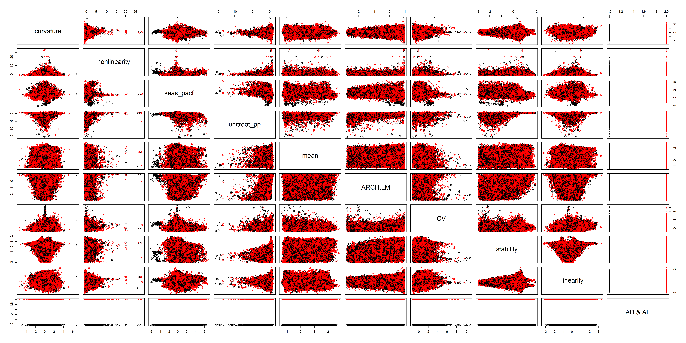

# On time series features and forecasting by temporal aggregation

On time series features and forecasting by temporal aggregation paper respresents the research started after International Symposium on Forecasting (ISL 2019) by:

* PhD [Dejan Mircetic](https://www.linkedin.com/feed/update/urn:li:activity:6993199240374050816/)
* PhD [Bahman Rostami-Tabar](https://www.bahmanrt.com/)

This is the joint research by:

* [Cardiff University](https://www.cardiff.ac.uk/people/view/598316-rostami-tabar-bahman) and
* [Artificial Intelligence R&D Institute of Serbia](https://www.ivi.ac.rs/).

The main focus of the research is questioning the common assumption that series in the higher level of temporal aggregation (lower frequency) are smoother with less noise and more cleaner patterns, which often implies that forecasts created on higher temporal aggregation levels are more accurate. This practice is usually present in supply chains, where practitioners are usually advised to aggregate the series to the frequency levels allinghed with their decision making horizons and then to create forecast for the period of interest. Is that always good? Or is it sometimes better to stay on the original level and forecast to the period of interest? Therefore the research question is should we stay (do not temporally aggregate data) and perform temporal aggregation of forecasts created on the original level, or should we go (temporarily aggregate data) and create forecasts on an aggregated level?

Additionally, there are some indications that time series characteristics can help in identifying those situations. Accordinglly, we bulid svereral ML models in order to help identifying the situations when each of the temporal appraoches can be used.

There is a lot of job in front of us, let's get do it. Updates coming soon...

# Update 

The paper in is in the review process of the Neurocomputing journal...

# Future research

In you love dealing with ML, forecasting and time series...and you are interested in a given topic, you are welcome to join us in a future researches! Theare are several directions in which we plan to contoinue given research, but the first one will be related to the replicating a given research with inntermitent series and extanding the ML models with convolution and recurecnt neural networks.

# Some of the findings...

 
