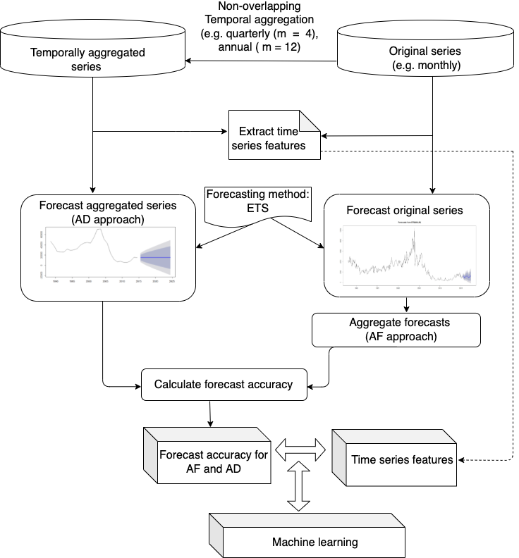
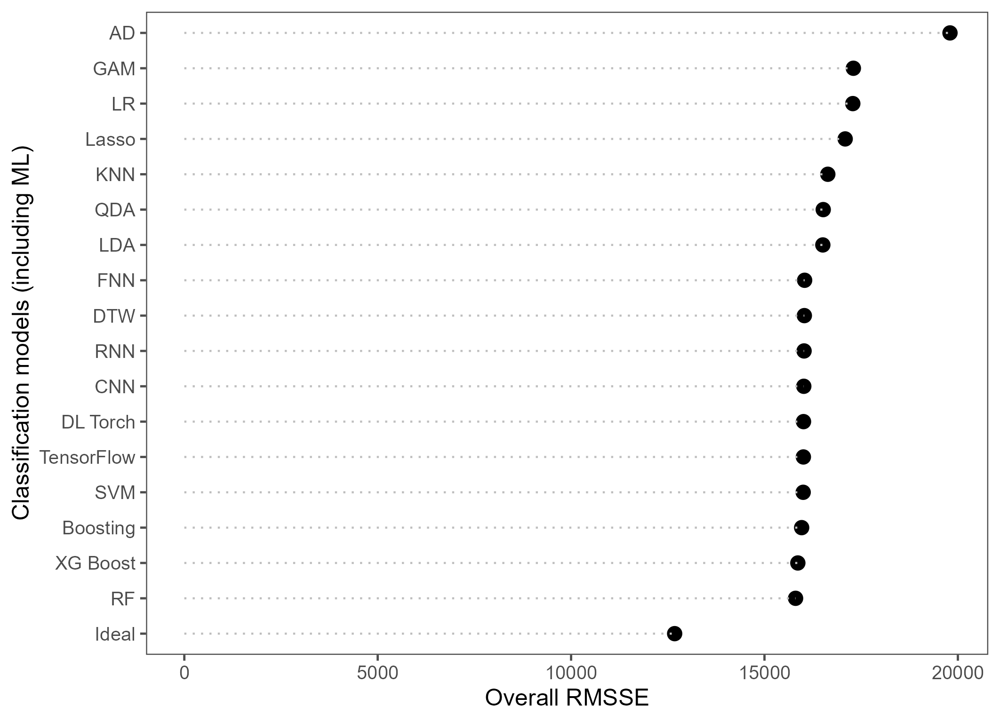
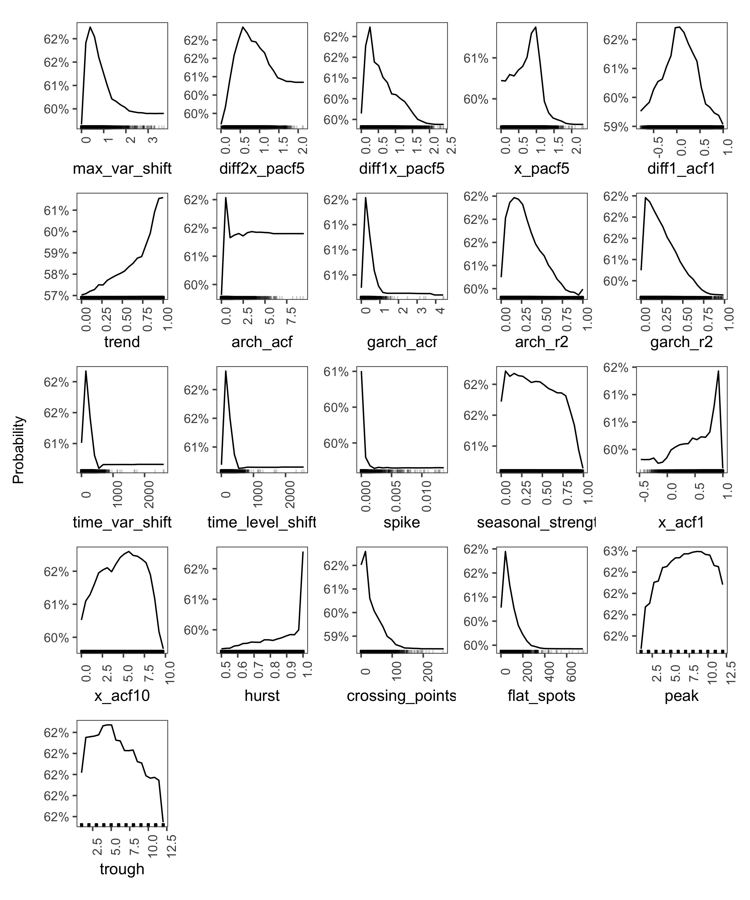

```{r setup, include=FALSE}
library(knitr)
knitr::opts_chunk$set(echo = FALSE, cache=FALSE, fig.pos = 'H', message = FALSE, warning = FALSE)
library(tidyverse)
library(kableExtra)
```

# Introduction

Time series forecasting has been used for many decades to inform decisions in various sectors such as business, finance, economy, supply chain and healthcare [@petropoulos2022forecasting]. With advances in technology, data can often be collected at the time of transaction or service, e.g. call arrival time in a call center, point of sales in retail or incidents attended in emergency medicine. In electronic databases, temporal data are generally stored in a single level of granularity.

One common assumption in time series forecasting is that the time series granularity matches the forecast requirement, i.e. to produce daily forecasts, we use daily time series. However, the level of time series granularity does not necessarily match the level of forecast granularity, driven by the decision-making process. Indeed, in practice, the level of temporal granularity in the forecast requirement is often lower than the existing time series granularity. For instance, while a forecast might be required at the daily (annual) level, the time series is available at hourly (monthly). We also recognise that there might be cases where forecast granularity is higher than the existing series, however this requires introducing a disaggregation mechanism and is not covered in this study.

Generally, forecast granularity level and its horizon are determined by decisions made in the light of forecast. In this paper, we consider a situation where an original time series has a higher temporal granularity (e.g. monthly) than the required forecast (e.g. annual). We aim to generate a forecast of the total value over a number of time periods ahead, which is refereed to forecast horizon aggregation or forecast over the leadtime period [@mohammadipour2012forecast]. Therefore,  the lead-time period matches the aggregation level that is used to aggregate time series.

Producing an aggregated forecast over a number of periods is not just an exception and there are many situations in organisations where such a forecast is required to inform decisions for capacity planning, inventory management, logistics, procurement, and others [@nikolopoulos2011aggregate,@zotteri2007model]. For example, generating a forecast for the whole lead-time period is often required to determine the level of safety stock in inventory management. In an emergency department, while the historical hourly time series of admission is available, daily forecasts might be required for rostering, while quarterly forecasts might be useful for resource planning [@rostami2020anticipating]. In a supply chain, yearly forecasts might be used for procurement and budgeting decisions, while the time series might be available at a monthly granularity [@mircetic2021forecasting].

<!--  However, this is not often true as the level of forecast requirement might be more aggregated(more granular) than the original time series, i.e foreast is required at weekly/monthly frequency while the frequency of time seris is daily. This becomes prominent with advances in data collection technologies because data can be collected at the time of service or transaction, e.g. arrival time in a hospital, point of sales data in retail industry, which means time series can be constructed at high sampling frequencies such as minute, hour and day. -->
<!-- Moreover, data analysts and decision makers in many organisations are involved in generating forecasts that inform planning decisions for capacity planning, inventory management, logistics, procurement, and others [@kourentzes2017demand]; with each decision having different forecasting frequency that is often higher than the frequency of the original series. For example, while the historical hourly number of attendance is available at the original level, daily forecasts are required for scheduling while yearly forecasts might be useful for recruitement and busdgeting.  -->

A key question then to be answered is: should the original time series be used to generated the forecast for the required horizon and then sum them up to obtain the forecast over aggregation level (lead-time), i.e. Aggregate Forecast (AF) or should we first aggregate the time series to match the forecast requirement granularity and then extrapolate directly at that level, i.e. Aggregate Data (AD). This has been illustrated in Figure \ref{fig:example_oanoa}. 

```{r example_oanoa, echo=FALSE, out.width="90%", fig.cap = "Aggregate forecast vs. aggregate data approaches. Assuming a montly time series is available and a forecast over one quarter (aggregation level = 3 months) is required. We first generate forecast for 3 periods ahead and then sum them up to create forecast over the quarter (Forecast by AF approach). Then, we create the temporally aggregated series by dividing the original series into the block of 3 periods. Next, we forecast for 1 period ahead (Forecast by AD approach)."}

```

For the later, we often use the non-overlapping temporal aggregation (NOTA) approach. Using this approach, the original series is divided into a consecutive non-overlapping bucket of time, starting from the most recent period backward. The size of the bucket is equal to the number of time periods required in forecasting, which is referred to aggregation level, $m$. The aggregated series is then created by summing up the values inside each bucket. The number of aggregate observations is $[N/m]$, where $N$ is the number of periods, and the $[x]$ operator returns the integer part of $x$ [@rostami2019impact]. We should also note that non-overlapping temporal aggregation 

There are some studies that investigate this question when considering forecasting at one single level of aggregation [@rostami2013demand, @rostami2014note, @kourentzes2017demand] or forecast combinations using multiple temporal aggregation levels [@kourentzes2014improving] or temporal hierarchies [@athanasopoulos2017forecasting]. These approaches have been applied [@nikolopoulos2011aggregate, @petropoulos2014forecast] in both intermittent demand [@nikolopoulos2021we]  and fast-moving demand contexts [@athanasopoulos2017forecasting]. 

The overall conclusion is that both aggregate forecast and aggregate data approaches may outperform each other. Their performance may depend on the presence of the autocorrelation in the original series, aggregation level, forecast horizon and the employed forecasting method (see, e.g., @boylan2016performance, @rostami2021aggregate, @rostami2014note @nikolopoulos2011aggregate). This study only applies to the case of a single level of aggregation, we can extend this study to examine the case of using multiple level of aggregation and hierarchies in the future.

Despite recent development in this area, there is still a lack of rules and indications on which approach should be used on each time series. In particular, given the features of the time sires, there is no solution of which strategy should be recommended to forecasters. This is the first study that explores the association between time series features and model performance in the context of forecasting by temporal aggregation (TA). The need for such a research has also been emphasised by @babai2021demand in a review article. This paper aims to shed lights on how the performance of temporal aggregation approaches (i.e. both AF and AD) is associated with time series features.

<!-- How might the characteristics of original time series influence the outperformance of each approach? -->
<!-- There is no research that investigate the relationship between forecast accuracy performance and temporal aggregation.  -->
<!-- It's very interesting to consider other data characteristics, other forecasting methods, both overlapping and non-Overlapping approaches etc -->
<!-- How might time series charactersitics helps forecasters and decion makers to answer this question. are there any particulat TSC that encourage using TA? what are those characterstics? in which situations one should use the original data to generate forecasts? how this might be affted by the choice of forecasting approach? -->

This study employs 48,000 time series from the monthly M4-competition dataset to assess empirically the performance of each approach and then examine the association between the original time series features and the forecasting performance evaluation using machine learning models. We then describe how non-overlapping temporal aggregation changes the features of time series, going from a high granularity level (e.g. monthly) to a low granularity (e.g. annual). Next, we discover which features are critical in predicting accurately the performance of each approaches, followed by an interpretation of features associated with the performance of AD or AF approaches. This will help us to provide recommendations to forecasters and decision makers on which approach to use. 

The research objectives are as following:

1. We measure 42 features of the time series at the original level and at various levels of aggregation. We reveal how TA changes the time series features;
2. We examine the forecast accuracy performance of AD and AF;
3. We build a machine learning model using feature engineering to predict accurately the performance of each approach;
4. We examine the association between time series features and the forecasting performance;
5. We determine for which type of time series features, each forecasting strategy might be preferable;


The rest of the paper is organised as follows: section \ref{lit} provides a brief overview of the use of temporal aggregation in time series forecasting. Section \ref{framework} describes the empirical experiment design, forecasting approaches, method and forecast accuracy metrics. Section \ref{tsfeatures} describes time series features and presents the time series features for monthly M4 competition dataset, followed by analysing how non-overlapping temporal aggregation affects time series features. We then examine the forecasting performance of AD and AF approaches. Section \ref{ml} presents machine learning algorithms and their performance on accurately classifying the performance of AD and AF for a given time series and its features. Section \ref{res} presents the important features and their connection with the performance of temporal aggregation approaches. Section \ref{con} provides concluding remarks and an agenda for future research.

# Research background {#lit}

In practice, a time series is generally stored at a single level of time granularity. When a time series is available at a higher granularity level (e.g. hourly, monthly), it is often expected to generate a forecast at lower granularity (e.g. daily, annual). Therefore, a forecast of the total value over a number of time periods ahead (i.e. lead-time or aggregation level) is required [@mohammadipour2012forecast].
In these situations, an obvious option, that is often recommended in practice [@goodwin2018profit], would be to first transform the higher granularity time series into the lower granularity that matches the forecast requirement, and then produce forecasts. The transformation is generally performed using non-overlapping temporal aggregation. 

Another approach is to aggregate forecast rather than data. In that case, we first produce forecasts using the higher granular time series for the forecast horizon (i.e. multiple periods ahead) and then aggregate them.
<!-- Non-overalapping TA can be seen as a filter of high-frequency components of the time series. As we aggregate, low frequency components will dominate and depending on the level of aggregation higher frequency components will become weaker or vanish altogether. For example, consider a monthly seasonal time series that is aggregated to an annual series. The high frequency seasonal component is filtered, while the observed variance of the time series will be mostly due to the trend/cycle component.  -->

The application of NOTA approach in time series forecasting has been initially studied in the econometric literature. They evaluated how NOTA may change the structure of Autoregressive Integrated Moving Average (ARIMA) processes [@wei1978some;@rossana1995temporal]. This literature is in favor of aggregated data using NOTA. They show that this approach leads to accuracy gains under the assumption of ARIMA process and using an optimal Conditional mean forecast.

@rostami2013demand and @rostami2014note further explored analytically the effect of NOTA on forecasting performance at both aggregated forecast horizon ( lead time) and the disaggregated level using Mean Squared Error (MSE). They assume that Single Exponential Smoothing (SES) forecasting method is applied to an ARIMA(1,1) time series. The determine the conditions under which aggregate data outperforms the aggregate forecast approach. They show that the superiority of each approach depends on the process parameters that are affecting time series features, parameters of the forecasting method, and aggregation levels. They conclude that NOTA performs better when autocorrelation is not highly positive. In contrast, they show that high positive autocorrelation as one of the key features of time series, favourites AF approach.
@rostami2019impact evaluated the impact of NOTA on forecasting demand and orders in a supply chain. They assume that the demand time series follows an ARMA(1,1), the stock policy is order-up-to-level and optimal forecasting is used to produce forecasts. They showed that although the NOTA does not lead to an accuracy improvement in terms of MSE at the retailer's level, however it can lead to MSE reduction at the manufacturer level and a reduction of the bullwhip effect.

@mohammadipour2012forecast also assessed analytically the effect of temporal aggregation when the time series process is integer autoregressive moving average, INARMA($p,q$), processes. The demonstrated that aggregate data leads to lower MSE compared to aggregate forecast approach when the value of the autoregressive parameter is high. They found that for short horizons and smaller values the series process with small autoregressive and moving average parameters and short length of forecast horizon.

The potential forecasting benefit of TA was investigated by @willemain1994forecasting and  @nikolopoulos2011aggregate in the context of intermittent time series. @willemain1994forecasting empirically compared the forecast accuracy improvement of AF and AD approaches. They showed that aggregating time series can lead to more accurate forecasts. @nikolopoulos2011aggregate show that an NOTA approach may offer considerable improvements in terms of forecast accuracy. Further studies [@babai2012impact;@petropoulos2015forecast;@kourentzes2014improving;@spithourakis2011improving] confirmed empirically the forecast and stock control improvement resulted from NOTA. These studies covered both intermittent and fast moving time series.

@athanasopoulos2011tourism investigated the benefits of aggregate forecast versus aggregate data in an empirical study consisting of 366 monthly series. Various forecasting methods including state space models for exponential smoothing (ETS) and ARIMA, and the Theta are considered. Their findings are in favor of aggregating forecast. They found that aggregating forecast from either monthly or quarterly to yearly leads to more forecast accuracy improvements than yearly forecasts generated from the NOTA yearly series.
Using time series of order and point-of-sale in a retail supply chain, @jin2015forecasting assessed the benefits of NOTA for forecast accuracy. They found that NOTA leads to more accurate forecasts when the autocorrelation of time series is not highly positive. In a study where a high frequency time series is used, @luna2011top showed that in daily forecast of cash withdrawals, NOTA results in similar or better forecast than using hourly series.

Some studies have investigated the benefits of producing forecasts using multiple time series resulted from NOTA approach, corresponding to multiple levels of aggregation. Forecasts are generated at each level and then combined to obtain the required forecast. @kourentzes2014improving recommended using multiple levels of aggregation and combining the separate forecasts (MAPA). Multiple studies in intermittent time series forecasting, promotional modeling and inventory management highlighted the gain of using multiple TA levels [@petropoulos2014forecast;@kourentzes2015forecasting,@barrow2016distributions]. @athanasopoulos2017forecasting proposed Temporal Hierarchies Forecasting (THieF), which creates multiple temporally aggregated series using NOTA, generate forecasts and then reconciles them to obtain the required forecast.


<!-- A short section on time series features -->

Collopy and Armstrong (1992) developed a rule-based system containing 99 rules to produce forecasts based on the
features of the data. Adya et al. (2001) identied time-series features automatically
for rule-based forecasting. Petropoulos et al. (2014) explored the factors that aect
forecasting accuracy in the eld of demand forecasting, and proposed related selection
protocols. Kang et al. (2017) used Principal Component Analysis (PCA) to visualize
the forecasting algorithm performance in the time series instance spaces and had a better
understanding of their relative performance. Finally, Talagala et al. (2018) used a decision
tree to select the best forecasting method based on 42 manual features.

<!-- Another approach that also uses data manipulation to extract additional information -->
<!-- is (non-overlapping) temporal aggregation (Nikolopoulos et al., 2011).  -->

<!-- M4 data set in the M4comp2018 R package (Montero-Manso et al., 2018).  -->


Although all approaches including AF, AD and using multiple TA levels have demonstrated forecasting gain, arguably none of them are suitable to be used in every situation. Almost all studies in the literature report an overall accuracy (e.g. average) rather than accuracy at the time series level.
We argue that some time series features may favorite using a particular approach over other. However there is no study in the literature that investigates the potential association between time series features and approach performance. This study will cover this gap by considering forecasts resulted from AF and AD approaches. 

# Experiment framework {#framework}

In this section, we describe the design of the empirical experiment used in this study. We first present the study framework, then introduce the forecasting approaches and method, followed by showing the forecasting error metrics.

Figure \ref{fig:expdes} illustrates the framework of the experimental design performed in this study. The framework consists of several steps which are described as following. For any time series, we complete the following steps: 

1. The original time series is transformed into temporally aggregated series for a given aggregation level, $m$; 

2. A set of features is extracted for the original and aggregated time series; 

3. A forecasting method (i.e. ETS) is applied to the original series to generate forecast for $m$ periods ahead; 

4. Forecasts per each period are added up to obtain the forecast over the aggregated horizon (forecasts from AF); 

5. Forecasts are generated for temporally aggregated series (forecasts from AD);

6. Forecast accuracy is calculated for each series;

7. A database consisting of time series features and the performance of the AF and AD approaches is constructed. Time series features are used as an input (predictors) and the winning approach (labeled as AF or AD based on the minimum error metric) creates the response variable;

8. Several machine learning (ML) models are built to accurately predict the superiority of AF/AD approaches using the data created in step 7. These models include: 1) Logistic regression (LR), 2) Linear discriminant analysis (LDA), 3) Quadratic discriminant analysis (QDA), 4) K-Nearest Neighbors (KNN), 5) Lasso, 6) Generalised Additive Model (GAM), 7) Boosting, 8) Support Vector Machine (SVM) and 9) Random Forest (RF). Researchers are referred to @james2021statistical for a detail description of these approaches.
Given the outperformance of the random forest among all ML models used in this study, we will describe it in more details in section \ref{ml}. 

The ML model can also help us to identify the most important time series features that lead to the outperformance of RF. Moreover, it can also reveal how time series features are connected to the performance of AD/AF. 

Due to the page restriction, details regarding the initial set up, method of optimization, cost function, etc of these algorithms; are available by request from the authors. The experiment has been conducted in R software, and the authors are happy to share the code for reproducibility upon request.

```{r expdes, echo=FALSE,fig.align='center', out.width="70%", fig.cap = "Design of the experiment framework"}

```

## Forecasting approaches

We consider two different approaches to produce the forecast horizon aggregation. Given that the original time granularity is monthly, we aim at generating forecasts for various aggregation levels that corresponds to 2-monthly (m = 2), quarterly (m = 3), 4-monthly (m = 4), semi-annual (m = 6) and annual (m = 12) time granularity.

The first approach is to aggregate forecasts (AF). This approach first involves creating the base forecasts for $m$ periods ahead. These forecasts are then aggregated, because forecasting at the aggregation horizon level is of interest. The main advantage of AF is that there is no loss of information from the data because initial base forecasts are generated at the lowest disaggregated level. AF approach can capture the dynamics of the high frequency series, however they may be noisy and difficult to model. In the case of stationary time series, the AF approach may produce a more accurate forecast when the autocorrelation of the underlying demand series is highly positive [@rostami2014note]. Conversely, there is an absence of researches in the case of non-stationary time series. Therefore, this research is dealing with both stationairy and non-stationary time series and provides insight into the perplexity of interactions between different factors that influence on AF approach.

The second approach is to aggregate data (AD). This approach consists of applying the non-overlapping temporal aggregation approach to the original series, using the time granularity level for which the forecasting is needed. Following that the process of forecasting the temporally aggregated series for one atep ahead is performed. Benefits of AD can be seen in the reduction of the noise in the data, as well as in revelling the more smooth patterns that exist in the series. The NOTA of the series usually sheds light on the key time series features, which are more notable and clearer as we perform the aggregation to the lower granularity levels (e.g. quarterly, annual).

## Forecasting method

The exponential smoothing state space (ETS) models [@hyndman2021forecasting] are used to produce out of sample forecasts, although our experiment design is model agnostic and could be expanded to any other forecasting model. ETS can capture trend, seasonality and error components in a time series through various forms such as additive, multiplicative or mixed. ETS accounts for 18 different exponential smoothing models. The automatic exponential smoothing model is used using _ets()_ function in the forecast package [@hyndman2008automatic] in R to produce forecasts for the original and aggregated time series. For each series, *ets()* identifies the most accurate model using the corrected Akaike’s Information Criterion (AICc). Using an automatic forecasting method such as  ETS is suitable for this study, as we can assume that the best model is selected for each series and this may help to separate the effect of the applied forecasting method from TA approaches (i.e. AF and AD).


<!-- The forecasting horizons are 12, 24 and 60 steps ahead for the series on the monthly level, which corresponds to the 1, 2 and 5 steps ahead on the annual level.  -->

## Forecast accuracy measures {#errormetric}

In this experiment, forecast accuracy evaluation is required two different stages. 

We first use an error metric (e.g. Root Mean Squared Scaled Error) to quantify the forecast accuracy of AF and AD in generating time series forecast over leadtime for each time series and ETS method. We consider the in-sample and the out-of-sample sets in monthly M4 competition time series. We apply the ETS method to each series in the in-sample dataset and keep their forecast for the out-of-sample using time series cross validation with re-estimation. The forecast horizon for the original time series equals $m$, the aggregation level, and the horizon for non-overlapping aggregated series is one. We then compute the forecast errors over the test period of each time series. To evaluate the forecast accuracy and bias, several measures including Root Mean Squared Error (RMSE), Mean Absolute Error (MAE) and Mean Error (ME), Mean Absolute Percentage Error (MAPE), Mean Absolute Scaled Error (MASE) and Root Mean Squared Scaled Error (RMSSE) are used. Due to the space restriction, we only present results of the RMSSE. Forecast accuracy results for other error metrics are available by request. RMSSE is given by:

$$ \text{RMSSE} = \sqrt{\text{mean}(q_{j}^2)},$$

where

$$q^2_{j} = \frac{\displaystyle e^2_{j}}
    {\displaystyle\frac{1}{T-m}\sum_{t=m+1}^T (y_{t}-y_{t-m})^2},$$


Second, we need to report how accurately a classification model predicts the outcome (i.e. the most accurate approach labeled as AF and AD), when presented with a set of time series features at the original series. To that end, we report several statistical measures including  misclassification error, F-statistics and area under the curve (AUC).

<!-- false positive rate and false negative rate.  -->

The misclassification error is calculated as following:

$$Misclassification_{error} = 100\% \times \left( 1-\frac{(t_p+t_n)}{N}\right),$$

F statistic is defined as:

$$F_{statistics} = 2 \times 100\% \times \left(\frac{(tp/(tp+fp) \times tp/(tp+fn))}{(tp/(tp+fp)+tp/(tp+fn)}\right),$$

Where $t_p$ is true positive, $t_n$ is true negative, $f_p$ is false positive and $f_n$ is false negative.

The false positive rate represents the fraction of test cases in which AD was incorrectly classified as a right model to use, while in reality the AF was the correct one. Similarly, the false negative rate represents the fraction of test cases in which AF was incorrectly classified as a right model to use, while AD was the correct one.

The area under the curve (AUC) represents the surface that is encompassed under the receiver operating characteristics (ROC) curve [@james2021statistical]. The larger the area under the ROC curves the better the classifier. The maximum value of AUC is 1, which would be considered a perfect classifier. Conversely, the classifier that performs no better than chance will have an AUC of 0.5 and would be considered as a very poor one.

In addition to the statistical measures discussed above, we also perform the utility evaluation of different models. The utility metric approximates the costs and benefit of wrong and correct classification. For that purpose, average RMSSE error is used as a utility metric. 

To assess the prediction accuracy of ML models, we split the data created in the step 7 of Section \ref{framework} into a training and a test set. To that end, we randomly divided the data on train and test set in a 70/30 % split. The train data (33600 cases) is used for training different algorithms, while the test data (14400 cases) is used for evaluating the model's performance.

<!--we need the explanation of utility here-->

# Time series data, features and temporal aggregation performance {#tsfeatures}

In this section, we first introduce the time series features extracted for each time series. Following that, we illustrates these features for the monthly M4 competition dataset. Then, we describe how non-overlapping temporal aggregation affects these features. Finally, we discuss the forecasting performance of AD and AF applied on monthly M4 dataset. 

## Time series features

Table \ref{tab:summaryfeature} presents the description of 41 features used in this study. For each time series (original or aggregated), we compute a set of measures from the training data. These features are also described in detail by @wang2009rule and @hyndman2015large and @hyndman2021forecasting.  


<!-- explain why we have considered all 42 features, why don't start with few features -->

```{r summaryfeature, cache=FALSE}
li <- readr::read_csv("feature.csv")
knitr::kable(li, booktabs = T, linesep = "",caption = "Time series features considered in this study and their descriptions") %>% kableExtra::kable_styling(latex_options = c("scale_down","hold_position"), font_size =11) 
```


## Time series features of monthly M4 data {#mtsmeasure}

We use the monthly M4 competition time series to empirically examine the performance of AD and AF and investigate the connection between their performance and time series  features. The monthly M4 data contains 48,000 time series. The dataset comes from the Economic, Finance, Demographics and Industry areas, while also including data from Tourism, Trade, Labor and Wage, Real Estate, Transportation, Natural Resources and the Environment [@Makridakis2018]. The monthly data is the most important data for the business applications [@Spiliotis2020] and therefore the largest class in M4, containing almost half of the data (48000 time series).


For each time series in the monthly M4 dataset, we extract 41 features as described in Table \ref{tab:summaryfeature} using _tsfeatue()_ function in the forecast package in R [@hyndman2008automatic]. Figure \ref{fig:feature1} and \ref{fig:feature2} illustrates the corresponding distribution of each feature. Y-axis shows the frequency in terms of the number of time series, and X-axis indicates the range of values extracted for each feature. This figure shows that the monthly M4 dataset covers a wide range of time series features, which makes it a suitable data for this research problem. Additionally, we include the origin of the time series M4 competiton data, i.e. Economic, Finance, Demographics and Industry, as the 42nd feature.

The spectral entropy plot indicates that there is a range of time series from easy (less noise, more systematic information) to hard (more noise, less systematic information) to forecast. Coefficient of Variation is also skewed to the right and indicates less variability for the majority of series.

The trend peaks near one and is skewed to the right indicating the strong presence of the trend in this dataset. We also observe that the nonlinearity feature peaks near zero and it is skewed to the right, which indicates the lack of nonlinearity in the time series. The autocorrelation lag1  and seasonal autocorrelation lag1 is skewed to the left, and is highly positive for many time series. We also measure the seasonal autocorrelation lag1 which is highly positive and : seasonal autocorrelation lag1 is high, and the lumpiness is extremely low for almost all time series and stability has a range from low to high values. We also measure seasonal partial autocorrelation and the strength of seasonality, both indicate a lower strength of seasonality. We also measure the stationaity(non-stattioanirity) of series using both unitroot_pp and unitroot_kpss statistics. They indicate a strong presence of staitonairy time series. Curvature shows a sharp distribution centered around zero meaning most series do not have stochastic or chaotic nature.
In particular, time series of stochastic nature are associated with curves displaying positive curvature in a neighborhood of their initial points, whereas curves related to chaotic phenomena have a negative curvature. Hurst has a left skewed distribution with almost all series with a values very close to one indicating the presence of the long memory for series, which is related to the autocorrelations. max_level_shift is centered around one and has a range of values between 0 and 3.

ARCH.LM (A time series exhibiting conditional heteroscedasticity—or autocorrelation in the squared series—is said to have autoregressive conditional heteroscedastic (ARCH) effects.)  (if ARCH.LM is close to 1, means there is ARCH effect?

The distribution of the e_acf10 values is skewed to right and the plot shows that for most of the time series e_acf10 is close to zero, which means the leftover from trend and seasonality seems to be random.

Readers can refer to the figure for the rest of features of monthly M4 time series.

```{r feature1, echo=FALSE,fig.align='center', out.width="70%", fig.cap = "Features of monthly time series from M4 competition dataset"}
knitr::include_graphics("img/300dpi/featurets1.png")
```

```{r feature2, echo=FALSE,fig.align='center', out.width="70%", fig.cap = "Features of monthly time series from M4 competition dataset (continue)"}
knitr::include_graphics("img/300dpi/featurets2.png")
```


## Effect of temporal aggregation on time series features {#taeffect}

In addition to extract the futures of the monthly time series, we also compute features after transforming the time series to bi-monthly, quarterly, 4-monthly, semi-annual and annual granularity. We use these features to demonstrate how non-overlapping temporal aggregation may change time series features. To highlight the effect of NOTA, we first started by plotting the distribution of features at each level, however the difference between distributions was not revealing because features have log-tail distributions. Instead, we categorise features of the original series to into four categories using quantiles: 

- If $0 < feature \leqslant 0.25$, Category = Very low
- If $0.25 < feature \leqslant 0.5$, Category = Very low
- If $0.5 < feature \leqslant 0.75$, Category = Very low
- If $0.75 < feature \leqslant 1$, Category = Very low

We then calculate the mean of features for each category and each time granularity to create the figures. The results have been demonstrated in Figure \ref{fig:featureagg1} and \ref{fig:featureagg2}. They show how time series features are changing from monthly to annual granularity for the time series features. The results indicate that as the level of time granularity increases from monthly to annual, some features become weaker and may disappear, while others dominate the series. The effect has been clearly indicated in Figure \ref{fig:featureagg1} and \ref{fig:featureagg2}. 


```{r featureagg1, echo=FALSE,fig.align='center', out.width="70%", fig.cap = "The effect of non-overlapping temporal aggregation on monthly time series features of M4 competition dataset"}
knitr::include_graphics("img/mp_category_all1.pdf")
```

We observe a decrease in curvature as we aggregate and it approaches zero at annual level, while non-linearity increases with aggregation indicating that series become more non-linear. Mean increases and variance decreases, however the effect is higher for very high category. We also observe that coefficient of variation decreases. Linearity is pushed toward zero if it is high or low, meaning that series at annual level losses its linearity feature. Both uniroot_pp and unitroot_kpss become close to zero with increasing aggregation level, highlighting the fact that series become more non-staitonairy if the monthly series if staitonairy, otherwise it remaoins almost the same. The measures related to seasonality such as seasonal strength, autocorrelation lag1 and the sum of squared of the first 10 autocorrelation decreases. It is interesting to observe that entropy increases with aggregation if it is not very high at monthly level, meaning that series become difficult to forecast. However we see a reduction in entropy if it is very high at the monthly level. We also observe an increase for ARCH.HM especially if it is very low at the monthly level. If it is very close to one, it stays almost unchanged.

```{r featureagg2, echo=FALSE,fig.align='center', out.width="70%", fig.cap = "The effect of non-overlapping temporal aggregation on monthly time series features of M4 competition dataset (continue)"}
knitr::include_graphics("img/mp_category_all2.pdf")
```

We observe that the by approaching the annual level, some features become unstable and showing chaotic behavior. We believe that this might be due to the fact that seasonality in the annual level is not calculated because it is cancelled out. However, the seasonality index might be used in calculating other features, hence the disorder of these features at annual level.

## Forecast accuracy evaluation of AD and AF approaches

In this study, we aim at generating forecasts for a forecast horizon aggregation leadtime period using AF and AD approaches. While the original time series temporal granularity is monthly, we require forecasts to be produced at Bi-monthly (aggregation level = 2), Quarterly (aggregation level = 3), 4-monthly (aggregation level = 4), Semi-annual (aggregation level = 6) and annual (aggregation level = 12).  

Figure \ref{fig:RMSSE} illustrates a Boxplot of RMSSE measure created for all 48,000 series at various level of forecast granularity requirement. Results demonstrate that both AF and AD approaches might outperform each other for different time series. However, AF approach is generating consistently more accurate forecasts through all aggregation levels and the difference becomes more pronounced as aggregation level increases. The difference is especially notable at the annual level. From 48000 monthly time series, the AF approach was superior in 30147 cases (63%) compared to 17853 cases (37%) for AD when forecasting annual time granularity. These results might be surprising regarding, because most findings in the literature recommend using NOTA over aggregate forecast and show improvements achieved on using temporal aggregation as discussed in section \@ref{lit}. However, we should note that almost all of these studies report the overall accuracy improvement, rather than the forecast accuracy at the series level. This study shows that recommending AD to forecast over the forecast horizon aggregation/leadtime might not necessarily lead to more accurate forecasts. Moreover, our results indicate that AF is a very competitive forecasting strategy. This might be also due to the time series features of the monthly time series discussed in section \ref{mtsmeasure}.

```{r RMSSE,echo=FALSE,fig.align='center', out.width="70%", fig.cap = "RMSSE errors through aggregation levels."}
knitr::include_graphics("img/300dpi/box_plot_rmsse.png")
```


<!-- # ```{r box, echo=FALSE,fig.align='center', out.width="100%", fig.cap = "RMSSE errors through aggregation levels."} -->
<!-- # knitr::include_graphics("img/boxplots.png") -->
<!-- # ``` -->

We have also conducted a statistical test using MCB (Multiple Comparison with the Best method) [@MCB] to assess the statistical significance in the performance of AF and AD approaches. 
<!-- The Figure \ref{fig:MCB} represents the MCB test for forecasting scenario were the initial data has a monthly frequency and the annual forecasts are required by decision-makers.  -->

From Figure \ref{fig:MCB}, it is evident that there is a statistical difference between forecasts generated from AF and AD. The forecasts generated from AD approach are less accurate, while the strategy of aggregating forecasts proves to be more  accurate. The results were cross-validated through multiple forecast horizons (h=12, 24 and 60) and via several other error metrics as described in \ref{errormetric}. The main conclusions are almost perfectly aligned with already demonstrated results in Figure \ref{fig:MCB}.

```{r MCB, echo=FALSE,fig.align='center', out.width="100%", fig.cap = "Performance of BU and DA models evaluated through MCB test. RMSSE errors are used for computing the ranks and a 95 percentile confidence level."}

```

<!-- add a sentence to say we have also calculated other measures -->

In Figure \ref{fig:RMSSE} we showed that both AF and AD have diverging performance through different levels of aggregation. Moreover, Figure \ref{fig:featureagg1} and \ref{fig:featureagg2} demonstrate the evolution of the time series features through these levels. Therefore, we argue that time series features can provide answers on why a particular approach is favorable in different situations. 
We should note that the results presented for the rest of paper are based on  AF and AD approaches to forecast annual aggregation level. There are multiple reasons to support this: 1) we see the highest difference in the performance at the annual level, ii) when the time series granularity is monthly, it is often the case that forecast requirement time granularity is annual, and iii) we investigated the analysis with other revels.
In the next section, we explore the association between time series features and AF and AD performance and build machine learning models for that purpose. 

# Machine learining models {#ml}

In this section, we use machine learning models to shed lights on the association between time series features and the performance of these approaches. Using the time series features at monthly time granularity and the RMSSE error metric generated for each approach (i.e. AF and AD), we build a machine learning algorithm to reveal relevant sets of features affecting the performance of these approaches. The first step in building such a model is to construct a dataset consisting of time series features and model class labels for a given time series. Therefore, we turn this problem into a classification supervised learning, using features as predictors and the winning approach (i.e. AD or AF) as the response variable or outcome for each time series.
We discover, extract and present the details on which time series features are the most influential on the accuracy of AF and AD approaches. In addition to interpretability, the algorithm should be able to accurately predict which model to use with a given set of  the time series features in the original time series. We should note that we have use the RMSSE at the annual level given the pronounced difference in accuracy at that level.

Figure \ref{fig:featuresmatrix} shows a grid of scatterplots showing the bivariate interactions between various pairs of features. Each point corresponds to one time series. The figure also highlights the winning approach (i.e. either AF or AD) when forecasting for annual time granularity. The black dots represent the situations where AD was more accurate, while yellow dots represent the opposite. Given the number of features used in this study, it is unfeasible to include the scatterplot matrix for all pairs of features. Figure \ref{fig:featuresmatrix} shows only the pairs plot for 10 features.


```{r featuresmatrix, echo=FALSE,fig.align='center', out.width="100%", fig.cap = "Time series features matrix. Each point indicates one single time series with a feature in x-axis and another at y-axis. The black and yellow colors show the outperformance of AD and AF, respectively."}

```

Figure \ref{fig:featuresmatrix} demonstrates a perplexed relationship between features and AD/AF approaches, with a lot of noise, confounding features and lack of clear decision boundaries between AD and AF performance. It is clear that some features might have linear or non-linear relationships with each other, while others might be unrelated. For most of features presented in Figure \ref{fig:featuresmatrix}, there is no strong relationship.

Considering the complicated boundaries and relationship between predictors, we develop several machine learning algorithms to discover patterns and connections between time series features and the accuracy of the AF and AD approaches. 

## Evaluating the prediction accuracy fo ML models in classification

In this section, we examine the prediction accuracy of the ML models in classifying whether AD or AF should be used to forecast the horizon aggregation of a given time series, based on its features. We report the prediction accuracy of the ML classifiers using measures discussed in section \ref{errormetric}. We have designed an interactive ShinyApp that includes the prediction accuracy of ML approaches and can be accessed by readers [^1].

[^1]: https://supplychainanalytics.shinyapps.io/Evaluation_of_ML_models/.

Table \ref{tab:cost} demonstrate that RF model has the best performance with the lowest misclassification error, highest F statistics and one of the best AUC statistics.

\begin{table}
\caption{\label{tab:cost}Comparison of different ML models}
\centering
\begin{tabular}[t]{lccc}
\hline
 & F-statistics & Misclassification error & AUC\\
\hline
LR &  0.6083881 &  0.4383333 & 0.5676151\\
\hline
LDA & 0.7655532 & 0.3718750 & 0.5130521\\
\hline
QDA &  0.7121420 & 0.3929861 & 0.5499207\\
\hline
KNN &  0.6882851 & 0.3911806 & 0.5814969\\
\hline
Lasso & 0.6368112 & 0.4252083 & 0.5677939\\
\hline
GAM &  0.6042137 & 0.4383333 & 0.5707890\\
\hline
RF & 0.7773134 & 0.3367361 & 0.5704724\\
\hline
Boosting & 0.7646663 & 0.3640972 & 0.5267067\\
\hline
SVM & 0.7646663 & 0.3640972 & 0.5318491\\
\hline
DTW & 0.7093325 & 0.3888889 & 0.5616327\\
\hline
FNN & 0.7649972 & 0.3724306 & 0.5128323\\
\hline
DL Torch & 0.7649434 & 0.3678472 & 0.5230656\\
\hline
XG Boost & 0.7688268 & 0.3423611 & 0.5728495\\
\hline
TensorFlow & 0.7669575 & 0.3690972 & 0.5166527\\
\hline
RNN & 0.7659351 & 0.3710417 & 0.5142032\\
\hline
CNN & 0.7662412 & 0.3700694 & 0.5158014\\
\hline
\end{tabular}
\end{table}

<!-- We also plotted measures presented in Table Table \ref{tab:cost} in addition to the False positive and false negative in Figure \ref{fig:draftspider} in the Appendix.  -->

<!-- \begin{table} -->
<!-- \caption{\label{tab:cost}Comparison of different ML models} -->
<!-- \centering -->
<!-- \begin{tabular}[t]{lccccc} -->
<!-- \hline -->
<!--  & False positive & False negative & F-statistics & Misclassification error & AUC\\ -->
<!-- \hline -->
<!-- LR & 0.4087618  &   0.45600799  &  0.6083881 &  0.4383333 & 0.5676151\\ -->
<!-- \hline -->
<!-- LDA & 0.9439391 &    0.02995673  &  0.7655532 & 0.3718750 & 0.5130521\\ -->
<!-- \hline -->
<!-- QDA & 0.6768146 & 0.22334406 & 0.7121420 & 0.3929861 & 0.5499207\\ -->
<!-- \hline -->
<!-- KNN & 0.5270095 & 0.30999667 & 0.6882851 & 0.3911806 & 0.5814969\\ -->
<!-- \hline -->
<!-- Lasso & 0.4599963 & 0.40441584 & 0.6368112 & 0.4252083 & 0.5677939\\ -->
<!-- \hline -->
<!-- GAM & 0.3929831 & 0.46543881 & 0.6042137 & 0.4383333 & 0.5707890\\ -->
<!-- \hline -->
<!-- RF & 0.7980323 & 0.06102297 & 0.7773134 & 0.3367361 & 0.5704724\\ -->
<!-- \hline -->
<!-- Boosting & 0.3320958 & 0.49850216 & 0.5900013 & 0.4362500 & 0.5847010\\ -->
<!-- \hline -->
<!-- SVM & 0.4611101 & 0.36846777 & 0.6622840 & 0.4031250 & 0.5852111\\ -->
<!-- \hline -->
<!-- \end{tabular} -->
<!-- \end{table} -->

```{r MCB_ML, echo=FALSE,fig.align='center', out.width="100%", fig.cap = "\\textcolor{blue}{Performance of different models evaluated through MCB test. RMSSE errors are used for computing the ranks and a 95 percentile confidence level.}"}
knitr::include_graphics("img/300dpi/Fig_MCB_all(review).png")
```

The Figure \ref{fig:MCB_ML} shows the result of MCB test conducted to examine the difference between the performance of ML algorithms. The results shows that there is a statistically significant difference between the performance RF and all other models. According to the MCB test, AD approach generated the most inaccurate forecasts and therefore drastically underperformed compared to the others. All other ML models have much better performance, and the RF comes out as the ultimate winner in terms of mean rank classification accuracy on the test data set.

We also perform the utility evaluation of ML models. The results are presented in the Table \ref{tab:matrix}. The Table \ref{tab:matrix} represents the average values of RMSSE for AD and AF approaches when the correct classification was AD and AF, respectively. When the true model to use is AD (17853 causes), the average RMSSE error is 0.9028 for AD, and 1.5204 for AF. On the contrary, when the true model to use is AF (30147 causes), the average RMSSE error is 1.6568 for AD and 0.8669 for AF. In this way, we design the average costs and benefits associated with classification decisions and we are able to evaluate the ML models performances via practical utility measure contribution connected to their usage, and not just via standard statistical measures. This kind of performance evaluation has much more value for practitioners assessing the practical values of each ML model. The presented utility evaluation can be further extended in practice by linking the monetary costs to the decision based on the forecast. However, domain knowledge on the area where forecasts are implemented is required.

<!-- is the below table only for RF? -->

\begin{table}
\caption{\label{tab:matrix}Cost and benefit matrix}
\centering
\begin{tabular}[t]{lccc}

\multicolumn{2}{c}{} & \multicolumn{2}{c}{\bf Actual}\\ 
\cline{3-4}
& & AD\  & AF\\
\hline
\multirow{2}{4em}{\bf Predicted} & AD & 0.902872 & 1.6568039\\
& AF & 1.520416 & 0.8669348\\
\hline
\end{tabular}
\end{table}

Figure \ref{fig:tableCB} demonstrates that RF has the smallest utility metric (cumulative average RMSSE) while performing the classification task on the test data set. We have also included the Ideal model, a model that always predict correctly, to highlight the deviation of ML approaches from this benchmark and to reveal the max possible margin for reducing the overall cumulative RMSSE.

Therefore, the utility metric confirms that RF provides the best choice for a given time series, bearing in mind that RF has already demonstrated the best performance according to the classical statistical measures.

```{r, eval=FALSE, echo=FALSE}
#Drugi nacin da napravis tabelu, How this has been calculated?
\begin{table}
\caption{\label{tab:utiliy}Utility accuracy measure}
\centering
\begin{tabular}[t]{lrrrrrrrrr}
\hline
  & LR & LDA & QDA & KNN & Lasso & GAM & RF & Boosting & SVM\\
\hline
Overall RMSSE & 17283.65 & 16030.93 & 16519.03 & 16637.65 & 17188.18 & 17298.30 & 15798.30 & 17316.69 & 16969.60\\
\hline
\end{tabular}
\end{table}
```

```{r tableCB, echo=FALSE, warning=FALSE, fig.cap="Utility accuracy comparison",fig.align='center',out.width="60%"}

# library(kableExtra)
# table_CB <- read.delim("../shiny app/ML_models/table_CB.txt")
# table_fig <- table_CB %>% as_tibble() %>% pivot_longer(cols = 2:12, names_to = "ML model",values_to = "Overall RMSSE")
# 
# utility_plot <- table_fig[1:10,] %>%
#   ggplot(aes(x=  fct_reorder(`ML model`,`Overall RMSSE`) , y=`Overall RMSSE`)) +
#   geom_point(colour="black", size=3) + 
#   geom_segment(color="grey", lty=3, aes(x=`ML model`, 
#                     xend=`ML model`, 
#                     y=0, yend=`Overall RMSSE`))+
#   coord_flip()+
#   ggthemes::theme_few()+
#   labs(x="Classification models (including ML)")
#   ggsave(filename="utility.png",utility_plot,
#        width = 14, 
#        height = 9 ,
#        dpi = 300, units="cm")
# table_CB <- table_CB[,-c(1:3,13)]
# kable(table_CB,format="latex",booktabs=TRUE,caption = "Utility accuracy comparison", align = "ccccccccc")%>% 
#   kable_styling(latex_options="scale_down")%>% 
#   #row_spec(1, bold = T, color = "white", background = "red")
#   column_spec(8,bold = T, color = "black")
#https://stackoverflow.com/questions/53341155/coloring-rows-with-kableextra-based-on-cell-values
#https://haozhu233.github.io/kableExtra/awesome_table_in_html.html
```

Among several algorithms, the RF provided the most accurate results according to the several criteria. Therefore, we further discuss this approach in the next section in more details.

## Building the random forest algorithm

In this section, we describe  building the random forest. Classification trees are simple and powerful algorithm, which are often used in practice for classification supervised learning [@friedman2001elements]. They are easy to use, produce accurate predictions, and provide interpreatable results. 

The RF represent the upgraded version of the tree model. The idea behind the RF is that by averaging individual forecasts from the assembly of many trees, the variance will be significantly reduced and the final model will generate a forecast which has low variance and bias as well [@friedman2001elements]. The model building process consists of using multiple bootstrapped random sets of the original data for building the trees with only a part of the variables included in each individual tree [@breiman1996bagging].

Individually, these trees tend to overfit the data and generate future forecasts with large variance. But, at the same time, they produce a low bias. Therefore, in order to reduce the variance, the Bagging process is building many trees on slightly different train data (since the data is bootstraped-resampled) and averages forecasts of all the trees in one unique forecast. For the sake of improving the Bagging process, @breiman2001random introduced the RF as an algorithm that mimics the Bagging process, but uses only a small random sample of the available features, for building each classification tree. The idea behind this is instead of just "shaking" the data via bootstraped-resampled process, we are introducing additional randomness in the process by additionally "shaking" the features for the forecasting via random sampling of just part of the features. Therefore, each time a split in a tree is considered, a random sample of *m* predictors is chosen as a split candidates from the full set of *p* features. A fresh sample of *m* features is taken at each split, and typically *m* $\approx$ $\sqrt p$ [@friedman2001elements]. By forcing this process each time using the subsample of fresh features, the RF is decorrelating each tree. In this way, the process of averaging many different trees will reduce the variance more efficiently than in the case of correlated trees.

In order to generate the RF model, there are several questions and tuning parameters that need to be optimized so that the final model could generate reliable and accurate forecasts. For that purpose, @friedman2001elements have proposed the following methodology presented in the Algorithm \ref{alg:RF}.

\begin{algorithm}
    \caption{Random Forest methodology.}
    \begin{algorithmic}[1]
      \item For {$b=1$ to $B$:}
        \begin{enumerate}[label=(\alph*)]
          \item Draw a bootstrap sample \textbf{Z*} of size $N$ from the training data.
          \item Grow a random forest tree $T_b$ to the bootstrapped data, by recursively repeating the following steps for each terminal node of the tree, until the minimum node size $n_{min}$ is reached.
            \begin{enumerate}[label=\roman*]
              \item Select $m$ variables at random from the $p$ variables.
              \item Pick the best variable/split-point among the $m$.
              \item Split the node into two daughter nodes.
            \end{enumerate}
       \end{enumerate}
  \item Output the ensemble of trees $\{T_b\}^B_1$.
    \end{algorithmic}
    \vspace{0.2cm}
    To make a prediction at a new point $x$:\\[0.2cm]
    \textit {Regression}: $\widehat{f}^B_{rf}(x)= \frac{1}{B} \sum_{b=1}^B T_b (x)$.\\[0.2cm]
    \textit {Classification}: Let $\widehat{C}_b(x)$ be the class prediction of the $b$th random-forest tree. \\ 
    \phantom{Classification } Then $\widehat{C}^B_{rf}(x)=majority\;vote\; \{{C}_b(x)\}^B_1$.
    \label{alg:RF}
\end{algorithm}

```{r algorithm, eval= FALSE, echo=FALSE,fig.align='center', out.width="70%", fig.cap = "Determining the optimal depth and the of the trees in the random forest model."}
knitr::include_graphics("img/algorithm_delete.png")
```

The first question is how many features to randomly choose for training in each individual tree (i.e. tree depth)? The question of how many trees to use for fitting the RF model emerges also needs to be answered in parallel. In order to determine the optimal number of features and trees for building an RF model, the evaluation process is performed with a different number of features and trees in each split. Therefore, the resulting process represents the optimization problem of seeking the minimum of the surface generated by features in each split, trees and resulting out of the bag (OOB) forecasting error (please refer to Figure \ref{fig:surface}). OOB represents the misclassification error of the RF model while performing the classification tasks. Also, OOB is the approximation of the cross validated test error, since the process of fitting bootstrapped data sets consists from training the model on just part of the original data and than predicting the remaining part of the original data (i.e. out of bag data). By averaging OOB errors from many different tree models (which comprise the final random forest model), the final OOB is obtained. 

Figure \ref{fig:surface} reveals that increasing number of trees used for generating RF model reduces the misclassification error. A similar scenario is present with a features used in each split, where increasing the number of features (up to a certain point) reduce misclassification error. The presented surface is highly erratic and undulating, making it is hard to visually determine global minimum. For that reason, the performance of the four best RF models with feature splits (*m* = 6, 10, 21 and 42) are shown through a different number of trees used for fitting RF model (Figure \ref{fig:tree_depth}). 

The Figure \ref{fig:tree_depth} represents the optimal number of splits (randomly selected features) used during the process of building each classification tree, according to OOB forecasting error. As demonstrated in Figure \ref{fig:tree_depth} the OOB error is minimized on the depth of 10. Therefore, the optimal number of features (i.e. tree depth) for the RF model is 10.

```{r surface, echo=FALSE,fig.align='center', out.width="70%", fig.cap = "Surface plot of the number of features (depth), number of trees and misclassification error of random forest model."}

```

The second tuning question is how many trees should be used for generating the RF model? One of the good merits that help in this process is RF resilience on the overfitting. Apparently, the averaging process during RF building appears to be resilient to overfitting [@friedman2001elements]. Averaging process during the RF building phase remedies the negative effects of choosing too large a number of trees for fitting the model since this will not result in an increase in variance on the test data set. This implies that the penalty of choosing a too large number of trees on models' overall performance is minor. The criteria for this judgment is based on the OOB misclassification error which the RF model produces on a given data set. Accordingly, the optimal number of trees is chosen by determining the number of trees where the OOB misclassification error is stabilized (Figure \ref{fig:tree_depth}). From Figure \ref{fig:tree_depth} it is clear that error is stabilized by using the 3000 trees.

```{r tree_depth, echo=FALSE,fig.align='center', out.width="90%", fig.cap = "Determining the optimal depth and the of number the trees in the random forest model."}
knitr::include_graphics("img/300dpi/Fig_tree_depth_and_ntrees.png")
```


# Association between time series features and AF/AD performance{#res}

Since the RF consists of a large number of trees, it is no longer possible to represent the resulting statistical learning procedure using a single tree, and it is not clear which variables are most important to the procedure [@james2013introduction]. Therefore, the RF improves prediction accuracy at the expense of interpretability. Instead, it is possible to obtain the overall summary of the importance of each feature by measuring the mean decrease in the Gini index.


```{r RFpartial, echo=FALSE,fig.align='center', out.width="95%", fig.cap = "Predictor features importance spectrum for the M4 data. A feature importance is computed using the mean decrease in Gini index."}

```

The Figure \ref{fig:RFpartial} demonstrates the overall importance of the features used in building trees during the random successive process of generating the RF model. Importance of the features is determined by the decrease in total amount of the node impurity by splits over a given predictor and averaging over all trees in RF. The decrease of the node impurity is measured by the Gini index. A large values of the Gini index indicate the important features. Clearly some features prove to be more important than others in classifying accurately the AF versus AD approach. The most important features are: *curvature*, *nonlinearity*, *seas_pacf*, *unitroot_up*, *mean* and *ARCHM.LM*; while *origin*, *through*, *peak* and *flats spots* seems to be the least important for predicting which temporal aggregation method to use (AF or AD). The quantity being modeled here is the probability of correctly choosing the AD versus AF, and the opposite. The least important features have approximately half of the importance as the most significant ones. Difference in a decrease of node impurity from the *curvature* to the *origin* feature is more than 250 units, indicating the wide range of features importance.


```{r pdpcommon1, echo=FALSE,fig.align='center', out.width="100%", fig.cap = "Partial dependence plots"}

```

```{r pdpcommon2, echo=FALSE,fig.align='center', out.width="100%", fig.cap = "Partial dependence plot (continue)"}

```


Figure \ref{fig:pdpcommon1} and \ref{fig:pdpcommon2} represent the partial dependence plot for all 41 features. The quantity being modeled here is the probability of classifying AF versus AD. Therefore, the dependent value is a probability of correctly aggregating forecasts i.e. AF approach.


The plots illustrate the marginal effect of the selected features on the response (outcome) after integrating out all the other variables and their average effect on the response [@james2013introduction]. 

The rug marks at the bottom of each plot show the distribution of feature across the variable range. Note that here the data density is lower near the edges. This may cause unstable behavior of the curves in those areas. The vertical scales of the plots show the probability of AF approach providing more accurate forecast for each feature as values of that feature changes. It is clear from Figure \ref{fig:pdpcommon1} and \ref{fig:pdpcommon2} that the features have a mixed effect on the classifying to the AF and AD approaches. While the effect might be clear for feature such as trend or non-linearity, it is less clear for other such as 

We observe that increasing trend, ARCH.LM, hurst, autocorrelation lag 1, unitroot_pp and seas_pacf may increases the chance of AF performing better, therefore AF become preferable. However, increasing lumpiness, entropy, no-linearity, curvature, strength of seasonality may increase the chance of AD performing better, so the strong presence of these features may favorite AD over AF. It is important to note that we are less interested in the exact probability in these plots. Instead, we are interested in discovering how changing time series feature may increase/decrease the chance of AF or AD.

# Conclusions {#con}

In time series, the forecast time granularity required to inform a decision might be different from the time series granularity. For instance, if a time series is recorded in a higher frequency (e.g. monthly), forecast might be required at a lower frequencies (e.g. annual). This is very common in modern organisations as data can be collected in the finest time granularity, such as sub-daily. Therefore, there are situations where a forecast of the total value over a time periods ahead (e.g. horizon aggregation/leadtime) is needed. To generate such a forecast for a given time series, we may consider two options: i) First generate forecasts, followed adding them up to obtain the forecast horizon aggregation (AF), or ii) First aggregate the time series using non-overlapping temporal aggregation and then and then generate the forecast (AD). In this paper, we design and execute an empirical experiment framework using monthly M4 competition data to i) explore the forecasting performance of these approaches; ii) investigate the association between time series features and temporal aggregation approach performance (e.g. AF or AD).

There is a common assumption that series in the higher level of temporal aggregation (lower frequency) are smoother with less noise and more cleaner patterns, which often implies that forecasts created on higher temporal aggregation levels are more accurate. This practice is usually may exist in supply chains, where practitioners are usually advised to aggregate the series to the frequency levels aligned with their decision making horizons and then to create forecast for the period of interest. In this paper we questioned this practice and explore the comparative performance of AF and AD approaches. We conducted a comparative research of the forecasting performance using 48000 monthly series from M4 data, at different levels of temporal aggregation corresponding to generating forecasts at bi-monthly, quarterly, 4–monthly, semi-annual and annual levels. Results demonstrate that there is a significant number of series for which aggregate forecast (63%) outperforms aggregate data (37%).

Given the fact that there is a lack of rules and indications on which approach should be used on each time series. We further investigate the association between time series features and model performance. The need for such a research investigation has also been highlighted in the literature [@babai2021demand]. Therefore, we seek to shed lights on the effect of temporal aggregation on time series features and further investigate how they might affect the performance of AD and AF approaches. To that end, we first construct a database consisting of features of each time series as predictor and model class labeled as AF/AD as response/outcome. Then, we build several ML models to accurately predict the correct class and consequently recommend using the most accurate approach for a given time series and its features. Our results show that RF model provide the best performance in accurately classifying approaches measured through statistical and utility metrics. Moreover, RF model is used to reveal the most influencing time series features in resulting in an accurate prediction. Additionally, we extracted the partial dependence plot to describe a predictor contribution to the fitted model through a probability and show that how the value of a feature may favorite AF over AD.

The main findings of this paper can be summarised as follows:

- First of all, when forecasting for the aggregation horizon (leadtime) is required, we show that AF is a significantly better methodology to use overall. However, the result might be due to the exiting features of monthly M4 time series and AF might not be always a better approach if features are different such as sub-daily time series. The findings indicate that neither of the approaches are always the most accurate when the accuracy is reported at the individual time series level. The findings clearly show that if a low frequency forecast is required, when the time series has a higher frequency, then the most accurate forecast is not necessarily generated by non-overlapping temporal aggregation. This may call into question the justification of the common practice in such a situation.

- Second, non-overlapping temporal aggregation changes the features of time series. The magnitude of the change varies for different features. In particular, we observe that with increase in the aggregation level, the strength of seasonality, the autocorrelation, coefficient of variation, linearity, curvature  and KPSS unitroot statistic decrease. However, non-linearity, mean, variance, ARCH.LM, trend , unitroot pp statistics increase. Entropy is the only measure that both increases and decreases based on its initial value.

- Third, random forest model is the most accurate classifier ML algorithm in predicting which approach provides more accurate forecast given a set of time series features as input.

- Fourth, RF model revels that the top ten important features for predicting whether AF or AD should be used for a given monthly time series in M4 competition include *curvature*, *nonlinearity*, *seas_pacf*, *unitroot_up*, *mean*, *ARCHM.LM*, *Coifficient of Variation*, *stability*, *linearity* and *max_level_shift*.

- Fifth, dependence plots provide some indictions on how time series features may favorite AD over AF, vice-versa. We observe that increasing seas_pacf, trend, ARCH.LM, hurst, autocorrelation lag 1 and unitroot_pp increases the chance of AF performing better. While, increasing Coefficient of Variation, entropy, no-linearity, curvature increases the chance of AD performing better, so the strong presence of these features may favorite AD over AF.

Given the findings of this study and the potential value of temporal aggregation in time series forecasting, the current study could be extended in  a number of ways. Research into any of the following areas would prove to be useful:

- The proposed design framework should be replicated with intermittent time series, daily and sub-daily time series. Given the features of such series, the findings would add value to the current knowledge state;

- In this study we use all features to build the ML model, an alternative approach would be to use dimension reduction approaches for all features representing the same type of information such as seasonality, autocorrelation, noise, etc and then build the model;

- The current study only utilises the non-overlapping temporal aggregation. Research on how overlapping temporal aggregation affects time series features and its connection to forecasting performance needs to be investigated;

- Almost all research in the area of temporal aggregation focuses on point forecast. Further research is required to investigate the connection between time series features and effect of temporal aggregation when prediction interval and/or forecast density is required;

- The current framework can be extended to examine approaches such as MAPA **[Ref]** and Temporal hierarchies **[Ref]** utilising multiple levels of temporal aggregation instead of a single level, and their association with time series features;

- A further study could investigate the link between time series features and forecast accuracy when forecasts are required at the original higher frequency, hence a disaggregation approach should be employed.

# References {#references .unnumbered}