class: inverse
background-image: linear-gradient(to right, rgba(255, 255, 255, .1), rgba(1, 1, 1, .9)),url("resources/hierarchy_back.jpeg")
background-size: cover

```{r initial,include=FALSE}
library(knitr)
library(fontawesome)
library(fpp3)
library(patchwork)
options(htmltools.dir.version = FALSE,
  tibble.width = 60, tibble.print_min = 6)
opts_chunk$set(
  echo = TRUE, warning = FALSE, message = FALSE, comment = "#>",
  fig.path = 'figure/', cache.path = 'cache/', cache = TRUE, fig.retina = 3,
  fig.align = 'center', fig.width = 4.5, fig.height = 4, fig.show = 'hold',
  dpi = 120
)
```


```{r external, include = FALSE, cache = FALSE}

```

.large[.alert-bottom1[LSDG meeting] <br> <br> <br> <br>]
.center[.title[Demand Forecasting in Supply Chains: Aggregation and Hierarchical Approaches]]
.sticker-float[] 


.bottom[
Bahman Rostami-Tabar (`r fa("twitter", fill="#1da1f2")`[@Bahman_R_T](https://twitter.com/Bahman_R_T)) <br>
Website [www.bahmanrt.com](https://www.bahmanrt.com/)
]

---
background-image: url("resources/hierarchy-left.jpeg")
background-size: contain
background-position: left
class: middle

.pull-right2[
## Outline

- What is a hierarchical and grouped time series, and why they are essential in forecasting?

- What are common approaches to forecast hierarchical/groupoed time series?

- What is temporal aggregation, what are different TA approaches and how it may affect time series features?

- Given a high frequency time series (e.g. daily), If we want a lower frequency forecast(e.g. weekly), should we first forecast and aggregate them or first aggregate time series and forecast?

]

---
class: inverse

## Terminilogy

**One time series**

  - Time granularity
  - Temporal aggregation / temporal hierarchies


**Collection of time series**

  - Cross-sectional aggregation / hierarchical / grouped

---
background-image: url("resources/hierarchy-left.jpeg")
background-size: contain
background-position: left
class: middle

.pull-right2[
## Outline

- .remember[What is a hierarchical and grouped time series, and why they are essential in forecasting?]

- What are common approaches to forecast hierarchical/groupoed time series?

- What is temporal aggregation, what are different TA approaches and how it may affect time series features?

- Given a high frequency time series (e.g. daily), If we want a lower frequency forecast(e.g. weekly), should we first forecast and aggregate them or first aggregate time series and forecast?
]

---

## Informing decisions in multiple levels

.pull-left2[
- Multiple decisions
- Multiple level of forecasting requirements
- Coherency between different levels
- Using information avaialble at multiple levels
]

.pull-right2[
.center[]
]

---

## Hierarchical time series

A .remember[hierarchical time series] is a collection of several time series that are linked together in a hierarchical structure (unique structure).

```{r fcst-health, echo=FALSE, fig.align='center', out.width="70%"}
library(collapsibleTree) 
library(tidyverse)
# input data must be a nested data frame:
# Represent this tree:


`Total` <- tribble(
  ~type, ~role,
  "Store 1",   "SKU1",
  "Store 1",   "SKU2",
  "Store 1",   "SKU3",
  "Store 2",   "SKU4",
  "Store 2",   "SKU5"
)

p <- collapsibleTree( `Total`, 
                      c("type", "role"),
                      width = 900,
                      fontSize = 18,
                      height = 600,
  zoomable = TRUE)
p
```

---

## Grouped time series

A .remember[grouped time series] is a collection of time series that can be grouped together in a number of non-hierarchical ways.

```{r fcst-group, echo=FALSE, fig.align='center', out.width="70%"}
library(collapsibleTree) 
library(tidyverse)
# input data must be a nested data frame:
# Represent this tree:


`Total` <- tribble(
  ~type, ~role,
  "Supplier 1",   "SKU1",
  "Supplier 1",   "SKU2",
  "Supplier 1",   "SKU3",
  "Supplier 2",   "SKU4",
  "Supplier 2",   "SKU5"
)

p <- collapsibleTree( `Total`, 
                      c("type", "role"),
                      width = 900,
                      fontSize = 18,
                      height = 600,
  zoomable = TRUE)
p
```

---

## Grouped time series

```{r fcst-group2, echo=FALSE, fig.align='center', out.width="70%"}
library(collapsibleTree) 
library(tidyverse)
# input data must be a nested data frame:
# Represent this tree:


`Total` <- tribble(
  ~type, ~role,
  "Product family 1",   "SKU1",
  "Product family 1",   "SKU2",
  "Product family 2",   "SKU3",
  "Product family 2",   "SKU4",
  "Product family 2",   "SKU5"
)

p <- collapsibleTree( `Total`, 
                      c("type", "role"),
                      width = 900,
                      fontSize = 18,
                      height = 600,
  zoomable = FALSE)
p
```

---
## Hierarchical & Grouped time series
### Ambulance attendance

```{r HIERARCHY-GROUP, echo=FALSE, fig.align='center', out.width="70%"}
library(collapsibleTree) 
library(tidyverse)
# input data must be a nested data frame:
# Represent this tree:


`Total` <- tribble(
  ~region, ~departement,~priority,
  "Region1 1",   "Dep 1","Major injury",
  "Region1 1",   "Dep 1","Minor injury",
  "Region1 1",   "Dep 2","Major injury",
  "Region1 1",   "Dep 2","Minor injury",
  "Region1 2",   "Dep 3","Major injury",
  "Region1 2",   "Dep 3","Minor injury",
  "Region1 2",   "Dep 4","Major injury",
  "Region1 2",   "Dep 4","Minor injury",
  "Region1 2",   "Dep 5","Major injury",
  "Region1 2",   "Dep 5","Minor injury"
)

p <- collapsibleTree( `Total`, 
                      c("region", "departement","priority"),
                      width = 900,
                      fontSize = 18,
                      height = 600,
  zoomable = TRUE)
p
```

---
class: middle

.pull-left[
### Australian tourism regions

```{r ausmap, echo=FALSE, message=FALSE, out.width="100%"}
library(sf)
# Use Okabe-Ito color-blind friendly color palette
state_colors <- c(
  `New South Wales` = "#56b4e9",
  `Victoria` = "#0072b2",
  `Queensland` = "#009e73",
  `South Australia` = "#f0e442",
  `Northern Territory` = "#d55e00",
  `Western Australia` = "#e69f00",
  `Tasmania` = "#cc79a7",
  `Australian Capital Territory` = "#cccccc"
)
read_sf("tourism/Tourism_Regions_2020.shp") %>%
  rename(State = "STE_NAME16") %>%
  ggplot() +
  geom_sf(aes(fill = State), alpha = 0.8) +
  theme_void() +
  scale_fill_manual(values = state_colors)
```
]

.pull-right[
### Australian tourism data
- Monthly data on visitor night from 1998 -- 2017
- Geographical hierarchy split by

    - 7 states
    - 27 zones
    - 75 regions
]

---

## Australian tourism data

```{r tourism, echo=FALSE, message=FALSE, warning=FALSE}
# Read csv file of monthly data
OvernightTrips_Region <- readr::read_csv("tourism/OvernightTrips_2017.csv")[,-(1:3)] %>%
  # Replace outlier from Adelaide Hills
  mutate(
    `Adelaide Hills` = case_when(
      `Adelaide Hills` > 80 ~ 10,
                       TRUE ~ `Adelaide Hills`
    )
  )
# Convert to tsibble
tourism <- hts::hts(
    ts(OvernightTrips_Region, start=1998, frequency=12),
    list(7, c(6,5,4,4,3,3,2), c(2,2,1,4,4,1,3,1,3,6,7,3,4,3,2,3,3,4,2,3,1,1,1,2,2,3,4))
  ) %>%
  as_tsibble() %>%
  rename(
    state = "Level 1",
    zone = "Level 2",
    region = "Level 3",
    month = index,
    visitors = value
  ) %>%
  mutate(
    state = recode(state,
      A = "NSW",
      B = "VIC",
      C = "QLD",
      D = "SA",
      E = "WA",
      F = "TAS",
      G = "NT"
    ),
    zone = recode(zone,
      AA = "Metro NSW",
			AB = "North Coast NSW",
			AC = "South Coast NSW",
			AD = "South NSW",
			AE = "North NSW",
			AF = "ACT",
			BA = "Metro VIC",
			BB = "West Coast VIC",
			BC = "East Coast VIC",
			BC = "North East VIC",
			BD = "North West VIC",
			CA = "Metro QLD",
			CB = "Central Coast QLD",
			CC = "North Coast QLD",
			CD = "Inland QLD",
			DA = "Metro SA",
			DB = "South Coast SA",
			DC = "Inland SA",
			DD = "West Coast SA",
			EA = "West Coast WA",
			EB = "North WA",
			EC = "South WA",
			FA = "South TAS",
			FB = "North East TAS",
			FC = "North West TAS",
			GA = "North Coast NT",
			GB = "Central NT"
    )
  ) %>%
  select(month, everything())
# Show first 10 rows of data
tourism
```

---
## Australian tourism data

```{r tourism_plots, echo=FALSE, fig.width=8, fig.height=4}
p1 <- tourism %>%
  summarise(visitors = sum(visitors)) %>%
  autoplot(visitors) +
  ylab("Overnight trips") + xlab("Time") +
  scale_y_log10() +
  ggtitle("Total domestic travel: Australia")+
  ggthemes::theme_clean()
p1
```

---
## Australian tourism data

```{r tourism_plots1, echo=FALSE, fig.width=8, fig.height=4.5}
p2 <- tourism %>%
  group_by(state) %>%
  summarise(visitors = sum(visitors)) %>%
  autoplot(visitors) +
  ylab("Overnight trips") +
  scale_y_log10() +
  ggtitle("Total domestic travel: by state") +
  ggthemes::theme_clean()+
  theme(legend.position = "bottom",
                plot.background = element_blank(),
    panel.border = element_blank(),
    legend.text = element_text(size=8))
p2

p2 <- tourism %>%
  group_by(state) %>%
  summarise(visitors = sum(visitors)) %>%
  autoplot(visitors) +
  ylab("Overnight trips") +
  scale_y_log10() +
  ggtitle("Total domestic travel: by state") +
  ggthemes::theme_clean()+
  theme(legend.position = "none",
                plot.background = element_blank(),
    panel.border = element_blank(),
    legend.text = element_text(size=8))
ggsave("figs/tourisme2.png",p2)
ggsave("figs/tourisme1.png",p1)
```

---
## Australian tourism data

```{r tourism_plots2, echo=FALSE, fig.width=8, fig.height=4}
p3 <- tourism %>%
  filter(state=="NSW") %>%
  group_by(zone) %>%
  summarise(visitors = sum(visitors)) %>%
  mutate(zone = paste0("NSW/",zone)) %>%
  autoplot(visitors) +
  ylab("Overnight trips") +
  scale_y_log10() +
  ggtitle("Total domestic travel: NSW by zone") +
  guides(colour = guide_legend(title = "state/zone"))+
  ggthemes::theme_clean()+
  theme(legend.position = "bottom",
                plot.background = element_blank(),
    panel.border = element_blank())
p3

```

---
## Australian tourism data

```{r tourism_plots3, echo=FALSE, fig.width=8, fig.height=4}
p4 <- tourism %>%
  filter(zone=="South NSW") %>%
  autoplot(visitors) +
  ylab("Overnight trips") +
  scale_y_log10() +
  ggtitle("Total domestic travel: South NSW by region")+
 ggthemes::theme_clean()+
  theme(legend.position = "right",
        plot.background = element_blank(),
    panel.border = element_blank(),
    legend.text = element_text(size=8)
    )
p4
p4 <- tourism %>%
  filter(zone=="South NSW") %>%
  autoplot(visitors) +
  ylab("Overnight trips") +
  scale_y_log10() +
  ggtitle("Total domestic travel: South NSW by region")+
 ggthemes::theme_clean()+
  theme(legend.position = "none",
        plot.background = element_blank(),
    panel.border = element_blank(),
    legend.text = element_text(size=8)
    )
ggsave("figs/tourisme4.png",p4)

```

---
background-image: url("resources/hierarchy-left.jpeg")
background-size: contain
background-position: left
class: middle

.pull-right2[
## Outline

- What is a hierarchical and grouped time series, and why they are essential in forecasting?

- .remember[What are common approaches to forecast hierarchical/groupoed time series?]

- What is temporal aggregation, what are different TA approaches and how it may affect time series features?

- Given a high frequency time series (e.g. daily), If we want a lower frequency forecast(e.g. weekly), should we first forecast and aggregate them or first aggregate time series and forecast?
]

---
class: middle
## How to forecast hierarchical/grouped series?
.pull-left[
### Hierarchical series
```{r hierarchy-series, echo=FALSE, out.width="55%"}
knitr::include_graphics(c("figs/tourisme1.png", "figs/tourisme2.png","figs/tourisme4.png"))
```
]

.pull-right[
### Hierarchical forecasting approaches
```{r pyramid, echo = FALSE, out.width="90%"}
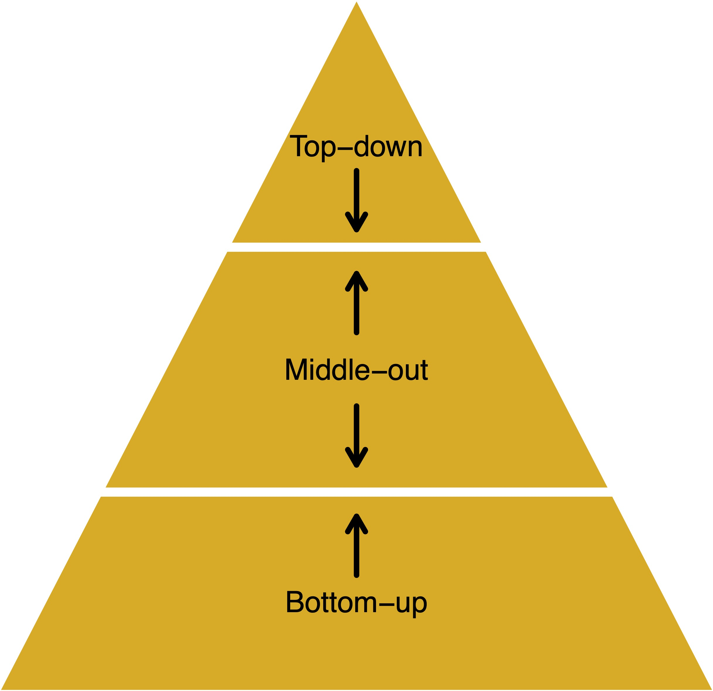
```
]

---

## Optimal reconceiliation

- This approach involves first generating independent base forecast for each series in the hierarchy. 
- As these base forecasts are independently generated they will not be “aggregate consistent” (i.e., they will not add up according to the hierarchical structure). 
- The optimal combination approach optimally combines the independent base forecasts and generates a set of revised forecasts that are as close as possible to the univariate forecasts but also aggregate consistently with the hierarchical structure.
- Unlike any other existing method, this approach uses all the information available within a hierarchy. 

---
## Research gaps

- There is a need to examine empirically the validity of these theoretical developments in supply chains 
- Very little research has examined the association between characteristics of time series and the performance of approaches
- The potential benefit of incorporating exogenous variables in a hierarchy structure still needs to be examined
- Using probabilistic forecasting in hierarchies instead of point forecast in supply chains
- The theoretical developments in this area do not support the count nature of time series
- Investigating the benefit beyond forecast accuracy

---
background-image: url("resources/hierarchy-left.jpeg")
background-size: contain
background-position: left
class: middle

.pull-right2[
## Outline

- What is a hierarchical and grouped time series, and why they are essential in forecasting?

- What are common approaches to forecast hierarchical/groupoed time series?

- .remember[What is temporal aggregation, what are different TA approaches and how TA may affect time series features?]

- Given a high frequency time series (e.g. daily), If we want a lower frequency forecast(e.g. weekly), should we first forecast and aggregate them or first aggregate time series and forecast?
]

---

## Temporal aggregation approaches

```{r ol-nol,echo=FALSE, out.width="75%"}
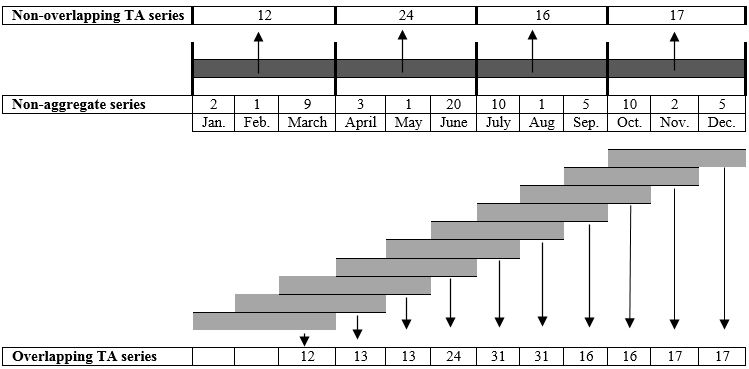
```

---
## Using TA (non-overlapping) to forecast

```{r adida,echo=FALSE, out.width="70%"}
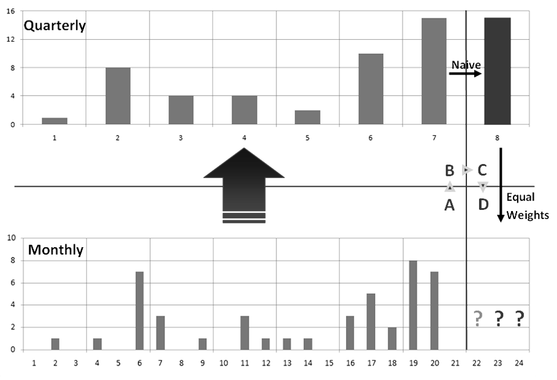
```

---
## Hourly time series: ambulance attendance

```{r hospital-dygraph, echo = FALSE,fig.width=8, fig.height=4.5}
library(dygraphs)
h2_hourly <- readr::read_csv("data/h2_hourly.csv")
tsbox::ts_xts(h2_hourly) %>% 
  dygraph() %>% 
  dyRangeSelector(dateWindow = c("2015-01-01", "2015-01-08"))
```

---
## Daily time series: ambulance attendance

```{r hospital-dygraph1, echo = FALSE, fig.width=8, fig.height=4.5}
library(dygraphs)
h2_hourly <- readr::read_csv("data/h2_hourly.csv")
daily <- h2_hourly %>% as_tsibble()  %>% index_by(date=as_date(arrival_1h)) %>% 
  summarise(admision=sum(n_attendance))
tsbox::ts_xts(daily) %>% 
  dygraph() %>% 
  dyRangeSelector(dateWindow = c("2015-01-01", "2015-01-21"))
```

---
## Weekly time series: ambulance attendance

```{r hospital-dygraph2, echo = FALSE, fig.width=8, fig.height=4.5}
h2_hourly <- readr::read_csv("data/h2_hourly.csv")
weekly <- h2_hourly %>% as_tsibble()  %>% index_by(week=yearweek(arrival_1h)) %>% 
  summarise(admision=sum(n_attendance))

weekly[1:(nrow(weekly)-1),] %>% ggplot(aes(x=week,y=admision))+
  geom_point()+
  geom_line()+
  ggthemes::theme_clean()+
  scale_x_yearweek(date_breaks = "2 month", date_labels = "%W %Y")+
  theme(axis.text.x = element_text(angle = 90))
```

---
## Monthly time series: ambulance attendance

```{r hospital-dygraph3, echo = FALSE,fig.width=8, fig.height=4.5}
library(dygraphs)
h2_hourly <- readr::read_csv("data/h2_hourly.csv")
monthly <- h2_hourly %>% as_tsibble()  %>% index_by(month=yearmonth(arrival_1h)) %>% 
  summarise(admision=sum(n_attendance))
monthly %>% ggplot(aes(x=month,y=admision))+
  geom_point()+
  geom_line()+
  ggthemes::theme_clean()+
  scale_x_yearmonth(date_breaks = "2 month", date_labels = "%b %Y")+
  theme(axis.text.x = element_text(angle = 90))
```

---
## Quarterly time series: ambulance attendance

```{r hospital-dygraph4, echo = FALSE,fig.width=8, fig.height=4.5}
library(dygraphs)
h2_hourly <- readr::read_csv("data/h2_hourly.csv")
quarterly <- h2_hourly %>% as_tsibble()  %>% index_by(quarter=yearquarter(arrival_1h)) %>% 
  summarise(admision=sum(n_attendance))
  
  quarterly[1:(nrow(quarterly)-1),]  %>% ggplot(aes(x=quarter,y=admision))+
  geom_point()+
  geom_line()+
  ggthemes::theme_clean()
```

---
## Yearly time series: ambulance attendance

```{r hospital-dygraph5, echo = FALSE, fig.width=8, fig.height=4.5}
library(dygraphs)
h2_hourly <- readr::read_csv("data/h2_hourly.csv")
yearly <- h2_hourly %>% as_tsibble()  %>% index_by(quarter=year(arrival_1h)) %>% 
  summarise(admision=sum(n_attendance))
  
  yearly[2:(nrow(yearly)-1),]  %>% ggplot(aes(x=quarter,y=admision))+
  geom_point()+
  geom_line()+
  ggthemes::theme_clean()
```

---
## Using information in multiple levels: MAPA
```{r mapa,out.width="70%", echo=FALSE}
knitr::include_graphics("figs/mapa.png")
```

---
## Using information in multiple levels: temporal hierarchies
```{r ta-hierarchy,out.width="100%",echo=FALSE}
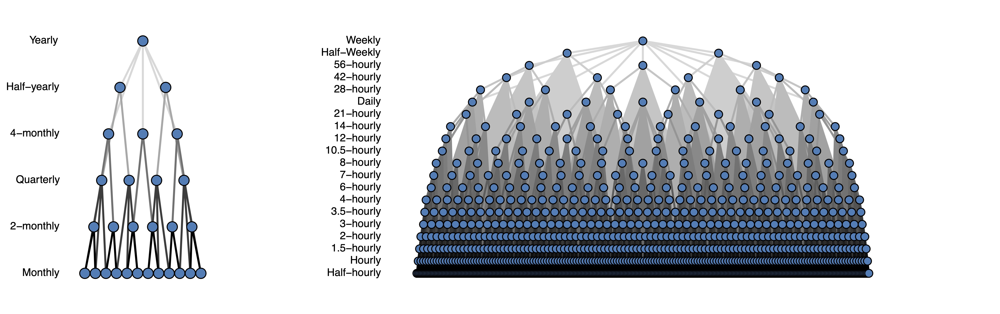
```

---
## Research gaps

- We are still unclear when overlapping, non-overlapping or BU should be used
- Investigate the association between time series features and the performance of each approach
- Investigate TA on high frequency time series (e.g. hourly)
- Linking forecast to utility measures
- TA research has been built on the non-overlapping aggregation assumption, the characteristics of time series when aggregated with an overlapping approach have not been fully identified yet
- Using probabilistic forecast rather than only point forecast

---
background-image: url("resources/hierarchy-left.jpeg")
background-size: contain
background-position: left
class: middle

.pull-right2[
## Outline

- What is a hierarchical and grouped time series, and why they are essential in forecasting?

- What are common approaches to forecast hierarchical/groupoed time series?

- What is temporal aggregation, what are different TA approaches and how TA may affect time series features?

- .remember[Given a high frequency time series (e.g. daily), If we want a lower frequency forecast(e.g. weekly), should we first forecast and aggregate them or first aggregate time series and forecast?]
]

---
## Experiment setup

.pull-left[
- M4 competition data time series

    - 24,000 Quarterly
    - 48,000 monthly
    - 4,227 daily
- Time series features

    - 42 features
    - use `tsfeatures::tsfeatures()` or `feasts::features()` in R
]

.pull-right[
- Forecasting methods: ARIMA and Exponential Smoothing State Space (ETS)
- Accuracy measure: Mean Absolute Scaled Error (MASE)
- Forecasting for lower frequency time using higher frequency time granularity (e.g. using monthly series to forecast bi-monthly, quarterly, yearly forecast)
]

---
```{r pb1, echo=FALSE, out.width="60%"}
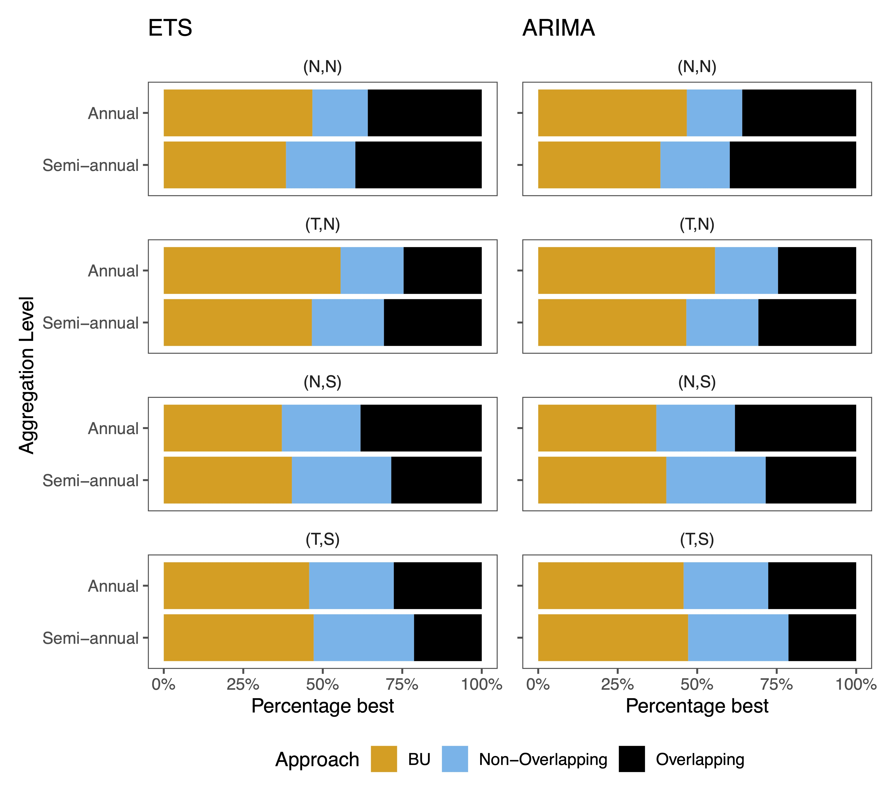
```

---
```{r pb2, echo=FALSE, out.width="60%"}
knitr::include_graphics("figs/p_best_monthly.jpg")
```

---
```{r pb3, echo=FALSE, out.width="60%"}
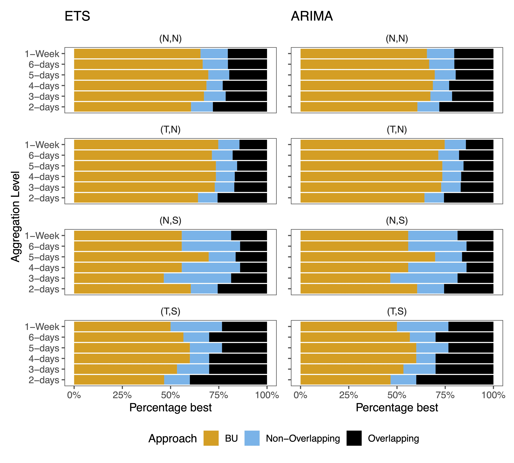
```

---
```{r plot-erro1, echo=FALSE, out.width="60%"}
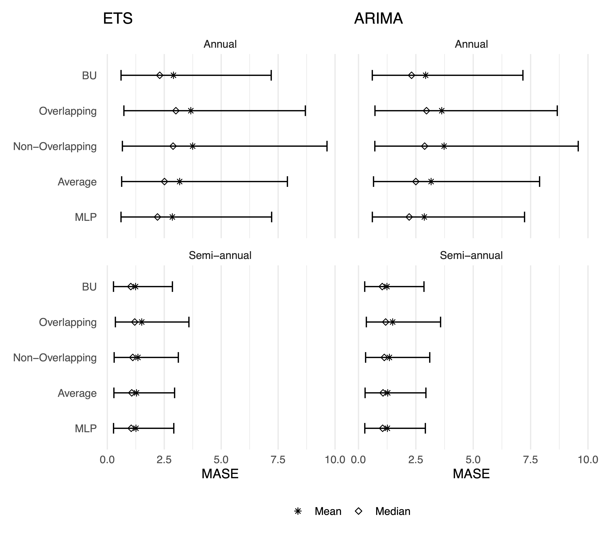
```

---
```{r plot-erro2, echo=FALSE, out.width="60%"}
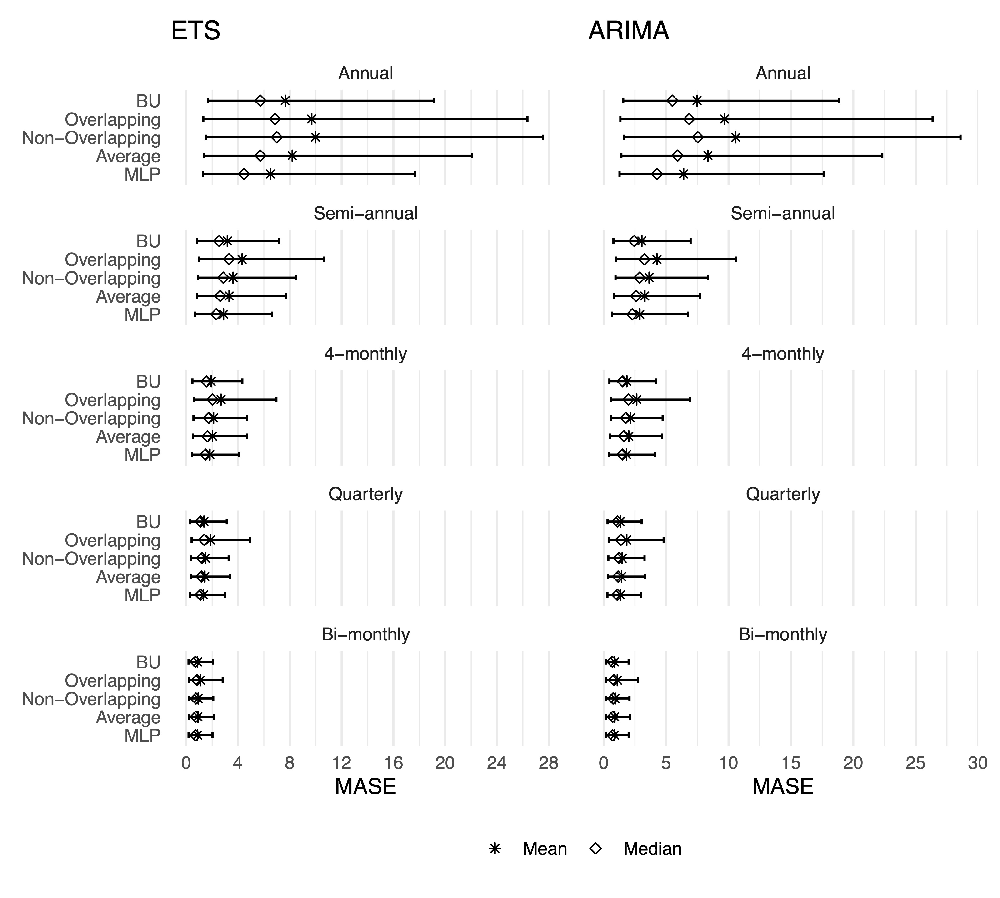
```

---
```{r plot-erro3, echo=FALSE, out.width="60%"}
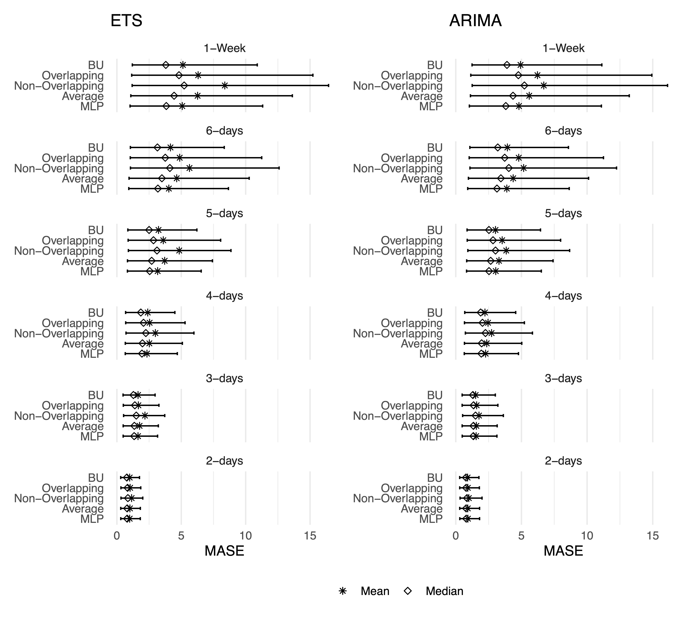
```

---
## Experiment design

```{r experiment, echo=FALSE, out.width="60%"}
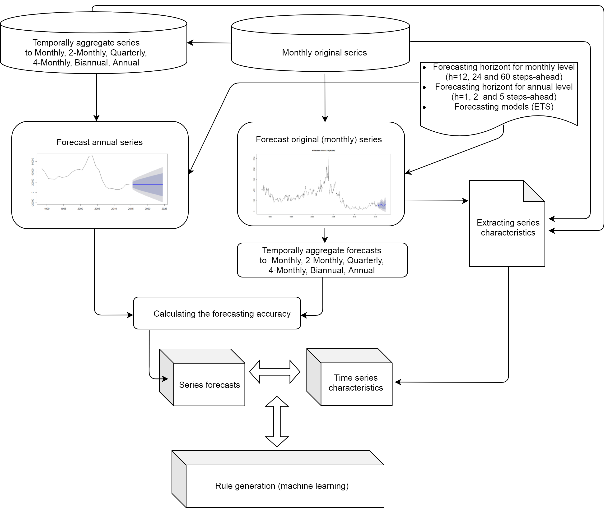
```

---
## How time series features change with TA

```{r ta-feature, echo=FALSE, out.width="50%"}
knitr::include_graphics("figs/mp_2_category.jpg")
```

---
## How time series features change with TA

```{r ta-feature1, echo=FALSE, out.width="50%"}
knitr::include_graphics("figs/mp_category.jpg")
```

---
```{r ml-predict, echo=FALSE, out.width="100%"}
knitr::include_graphics("figs/ML_predicting_power.png")
```

---
```{r feature-importance, echo=FALSE, out.width="100%"}
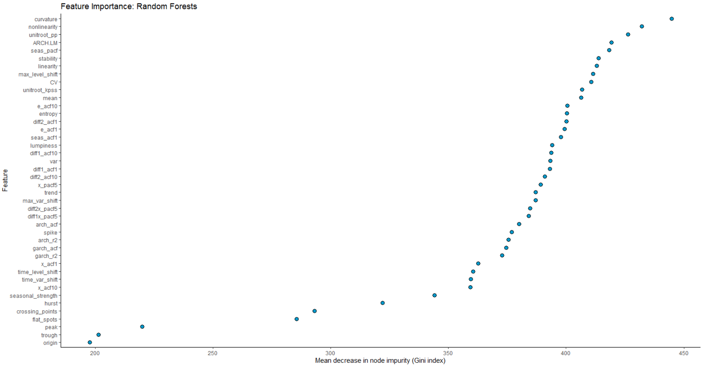
```

---

.pull-left[
### Wroks in progress

- Rostami-Tabar B. Hyndman J. R. (2022), hierarchical count time series forecasting in emergency medicine

- Rostami-Tabar B., Goltsos T. Wang, S. (2022), Overlapping and non-overlapping temporal aggregation: to combine or not to combine

- Rostami-Tabar, D. Mercetic (2022), Temporal aggregation and time series features
]

.pull-righ[
### Published recently
- Mircetic, D., et al. (2021), "Forecasting hierarchical time series in supply chains: an empirical investigation." International Journal of Production Research, 1-20.
- Babai. M.Z., Boylan, J., Rostami-Tabar, B. (2022), "Demand Forecasting in Supply Chains: A Review of Aggregation and Hierarchical Approaches", International Journal of Production Research, Accepted (to appear).
]

---
## References for hierarchical forecasting

- [Forecasting: Principles and Practice](https://otexts.com/fpp3/hierarchical.html), Chapter 11 Forecasting hierarchical and grouped time series
- ISF2021 Talk, Professor Rob J Hyndman, [Ten years of forecast reconciliation](https://youtu.be/5jB09R-sKOc)

---
## References for temporal aggregation forecasting

- [An aggregate–disaggregate intermittent demand approach (ADIDA) to forecasting: an empirical proposition and analysis](https://www.tandfonline.com/doi/full/10.1057/jors.2010.32?casa_token=FLX_iKeIDXcAAAAA%3ACXYWY6jICM_1_ayaadc8GXxN05kAFo5I_qqmt7XvBjEMTHBUTWLA8kziBWQhUVj-BdNWTwJnIw). Journal of the Operational Research Society.
- [Improving forecasting via multiple temporal aggregation](https://www.sciencedirect.com/science/article/pii/S0169207013001477?casa_token=PhrGiXHJJzsAAAAA:-PU7metoOVL4G7avKR6NT9m5kzGNHPy5Lo14iEhVHqtju_L_hRUatM0M3CV3UilcBA47EuU). International Journal of Forecasting.
- [Demand forecasting by temporal aggregation](https://onlinelibrary.wiley.com/doi/full/10.1002/nav.21546?casa_token=wfP5AIk8wAQAAAAA%3A4skkyZgQCyVdftE194ZG_16CgG7CfL6-6_kb2Sqi0aiJ0aC4cWL4x2bmmRMPdupj4P4_9lihPLj3), Naval Research Logistics
- [Forecasting with temporal hierarchies](https://www.sciencedirect.com/science/article/pii/S0377221717301911?casa_token=wVe_QYpCEFoAAAAA:LT-rFP_KTK8Wbr1iQnqpGpNXjKiocfoSBuM4-0SfYTEB_6njOQcELohyPLiuPQuSgEkstCc), European Journal of Operational Research


---
class: inverse, middle

- Slides and papers: [www.bahmanrt.com](www.bahmanrt.com)
- Check out also [www.f4sg.org](www.f4sg.org)

<br><br>
`r fa("twitter", fill = "white")` Say hello: [@Bahman_R_T](https://twitter.com/Bahman_R_T)

`r fa("linkedin-in", fill = "white")` Connect: [Bahman ROSTAMI-TABAR](https://www.linkedin.com/in/bahman-rostami-tabar-1046171a/)
