```{r initial,include=FALSE}
library(knitr)
library(fontawesome)
library(fpp3)
library(patchwork)
options(htmltools.dir.version = FALSE,
  tibble.width = 60, tibble.print_min = 6)
opts_chunk$set(
  echo = TRUE, warning = FALSE, message = FALSE, comment = "#>",
  fig.path = 'figure/', cache.path = 'cache/', cache = TRUE, fig.retina = 3,
  fig.align = 'center', fig.width = 4.5, fig.height = 4, fig.show = 'hold',
  dpi = 120
)
```


```{r external, include = FALSE, cache = FALSE}

```

.large[.alert-bottom1[CMAF FTT] <br> <br> <br> <br>]
.center[.title[On performance of temporal aggregation in time series forecasting]]
.sticker-float[] 


.bottom[
Bahman Rostami-Tabar (`r fa("twitter", fill="#1da1f2")`[@Bahman_R_T](https://twitter.com/Bahman_R_T)) <br>
Website [www.bahmanrt.com](https://www.bahmanrt.com/)
]

---
background-image: url("resources/hierarchy-left.jpeg")
background-size: contain
background-position: left
class: middle

.pull-right2[
## Outline

- Temporal aggregation: why do we need it in time series forecasting and what are the common approaches?

- How does temporal aggregation approaches perfrom on M4 competition data?

- Whether combining forecasts generated by temporal aggregation improves the forecast accuracy? how to combine (**Working paper 1**)?

- How data temporal aggregation changes time series features and how might time series features affect the forecasting performance of AD versus AF (**Working paper 2**)?
]

---
background-image: url("resources/hierarchy-left.jpeg")
background-size: contain
background-position: left
class: middle

.pull-right2[
## Outline

- .remember[Temporal aggregation: why do we need it in time series forecasting and what are the common approaches?]

- How does temporal aggregation approaches perfrom on M4 competition data?

- Whether combining forecasts generated by temporal aggregation improves the forecast accuracy? how to combine (**Working paper 1**)?

- How data temporal aggregation changes time series features and how might time series features affect the forecasting performance of AD versus AF (**Working paper 2**)?
]

---

## Using time series forecasting to inform decisions

.center[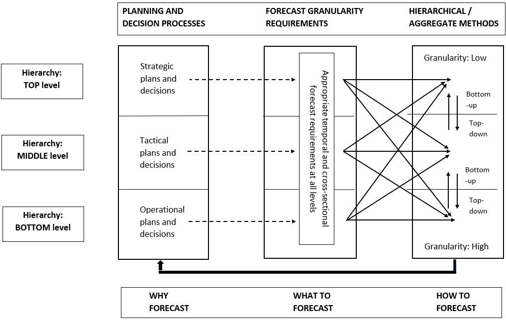]

.footnote[Babai, M. Zied, John E. Boylan, and Bahman Rostami-Tabar. "Demand forecasting in supply chains: a review of aggregation and hierarchical approaches." International Journal of Production Research (2021): 1-25.]

---
## Data and forecast time granularity

*  Forecasting time granularity level and its horizon are determined by decisions made in the light of forecast. 

--

* One common assumption is that time series granularity matches forecast requirement, i.e. to produce daily forecasts, we use daily time series.

--

* However, the level of time series granularity .remember[does not necessarily match] the level of forecast granularity.

--

* The level of temporal granularity in the forecast might be lower than the existing time series granularity. For instance, while a forecast might be required at the annual level, a monthly time series is available. With advances in IT, data is often recorded at the finest temporal granularity (e.g. arrival time)

---
## Time series forecasting problem
<br><br>

* We consider a time series forecasting problem where an original time series has a higher temporal granularity (e.g. monthly) than the required forecast (e.g. annual). 

* We aim to generate a forecast of the total value over a number of time periods ahead,  .remember[forecast horizon aggregation] or forecast over the leadtime period.

.footnote[1 Mohammadipour, Maryam, and John E. Boylan. "Forecast horizon aggregation in integer autoregressive moving average (INARMA) models." Omega 40.6 (2012): 703-712.]

---
class: middle

**A key question then to be answered is: **

should the original series be used to generated the forecast for the required horizon and then sum them up to obtain the forecast horizon aggregation (lead-time), i.e. .remember[Aggregate Forecast (AF)] or should we first aggregate time series to match the forecast requirement granularity and then extrapolate directly at that level, i.e. .remember[Aggregate Data (AD)]. 

** I will illustrate these approaches usign a simple example.**

.footnote[**There is no disaggregation to the original time granularity**]

---
class: inverse
## Terminilogy

**One time series**

- Data time granularity (e.g. daily, monthly, annual)
- Forecast time granularity (e.g. daily, monthly, annual)
- Forecast horizon (e.g. 12 months ahead)
- Forecast horizon aggregation /leadtime (e.g. 1 week, 1 quarter, 1 year)
- Temporal aggregation
    * Aggregate Forecast (or Bottom-Up)
    * Aggregate Data
      - Non-overlapping temporal aggregation (NOA)
      - Overlapping temporal aggregation (OA)
          
---
## Forecast horizon aggregation: an example

```{r ts,echo=FALSE, out.width="70%"}
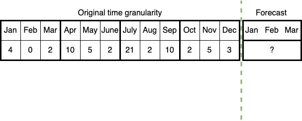
```

---
## Temporal aggregation: aggregate forecast

```{r ts1,echo=FALSE, out.width="70%"}
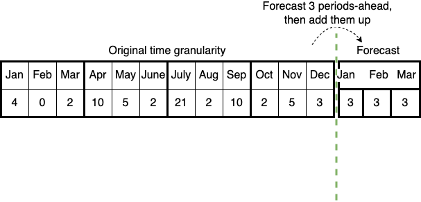
```

---
## Temporal aggregation: aggregate forecast

```{r ts2,echo=FALSE, out.width="70%"}
knitr::include_graphics("figure/ts2.png")
```

---
## Non-overlapping temporal aggregation: aggregate data

```{r tsona,echo=FALSE, out.width="70%"}
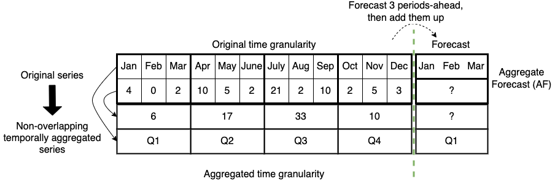
```

---
## Overlapping temporal aggregation

```{r tsoa,echo=FALSE, out.width="60%"}
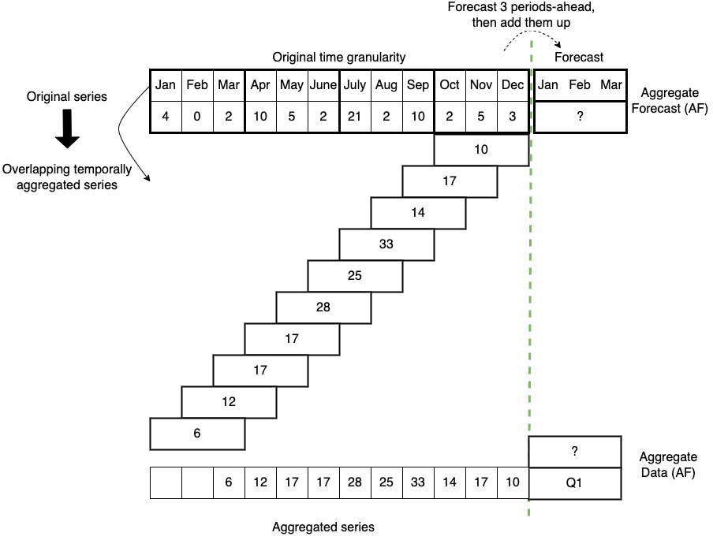
```


---
## Using information at multiple levels of time granularity instead of a single level - .remember[MAPA]

```{r mapa,out.width="70%", echo=FALSE}
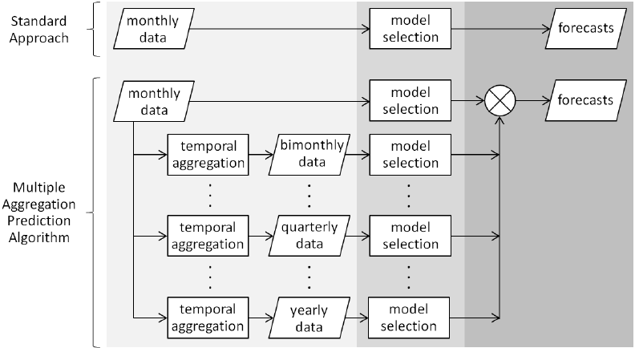
```

.footnote[Kourentzes, Nikolaos, Fotios Petropoulos, and Juan R. Trapero. "Improving forecasting by estimating time series structural components across multiple frequencies." International Journal of Forecasting 30.2 (2014): 291-302.]

---
## Using information at multiple levels of time granularity instead of a single level- .remember[temporal hierarchies]

```{r ta-hierarchy,out.width="40%",echo=FALSE}
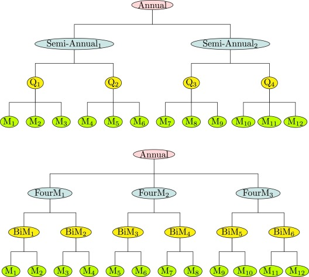
```

.footnote[Athanasopoulos, George, et al. "Forecasting with temporal hierarchies." European Journal of Operational Research 262.1 (2017): 60-74.]

---
class: inverse, center, middle

**It is often recommended to aggregate data and then forecast when a time series history is recorded at a higher frequency time granularity (e.g. monthly) and forecast is required at alower level (e.e. annual).**

For an exmpel, please refer to page 153 of Profit from Your Forecasting Software, by Paul Goodwin.

--

**Let's examine the performance of aggregating data versus aggregating forecat approaches using M4 competition dataset**

---
background-image: url("resources/hierarchy-left.jpeg")
background-size: contain
background-position: left
class: middle

.pull-right2[
## Outline

- Temporal aggregation: why do we need it in time series forecasting and what are the common approaches?

- .remember[How does temporal aggregation approaches perfrom on M4 competition data?]

- Whether combining forecasts generated by temporal aggregation improves the forecast accuracy? how to combine (**Working paper 1**)?

- How data temporal aggregation changes time series features and how might time series features affect the forecasting performance of AD versus AF? (**Working paper 2**)
]

---
## Time series data

.pull-left[
- M4 competition data time series

    - 24,000 Quarterly
    - 48,000 monthly
    - 4,227 daily
    
- Time series features
    - 42 features
    - Extract features using `tsfeatures::tsfeatures()` in R
]

.pull-right[
- Forecasting methods: Exponential Smoothing State Space (ETS) (ARIMA is also considered).
- Point forecast accuracy measure: Mean Absolute Scaled Error (MASE), Root Mean Squared Scaled Error (RMSSE), and more.
- Time series cross validation is performed.
]

.footnote[https://supplychainanalytics.shinyapps.io/Evaluation_of_ML_models/.]

---
## M4 Monthly time series features

```{r featurets1, echo=FALSE, out.width="40%"}
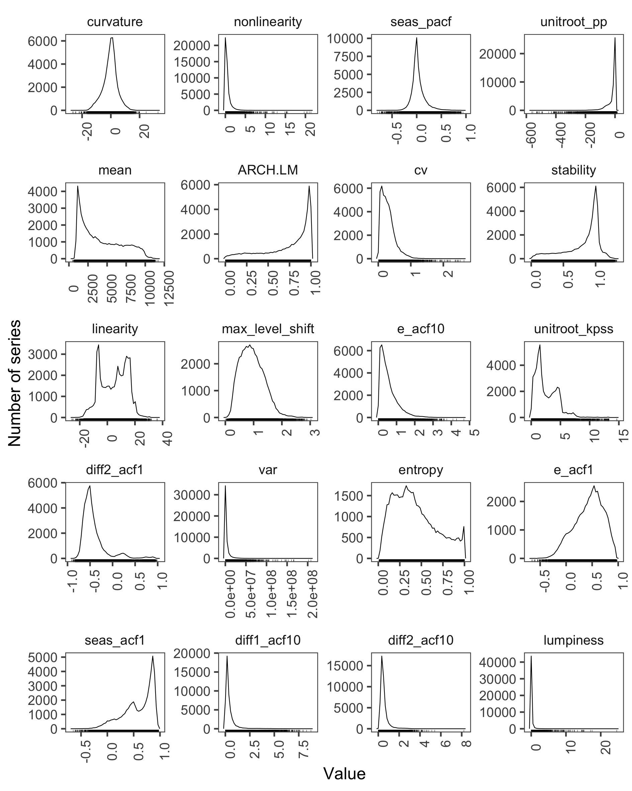
```

---
## M4 Monthly time series features

```{r featurets2, echo=FALSE, out.width="40%"}
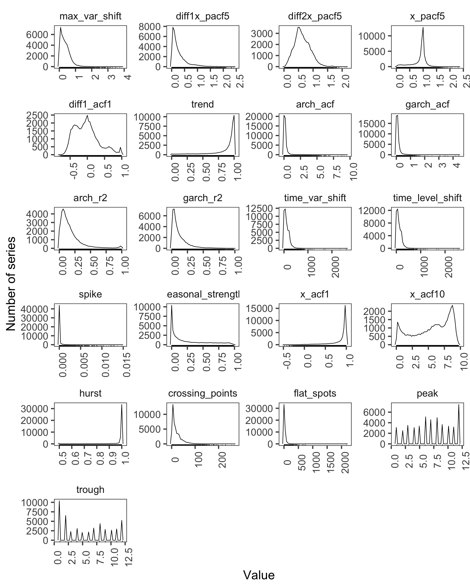
```

---
### Percentage of series for which each approach was more accurate ( using MASE)

```{r pb2, echo=FALSE, out.width="50%"}
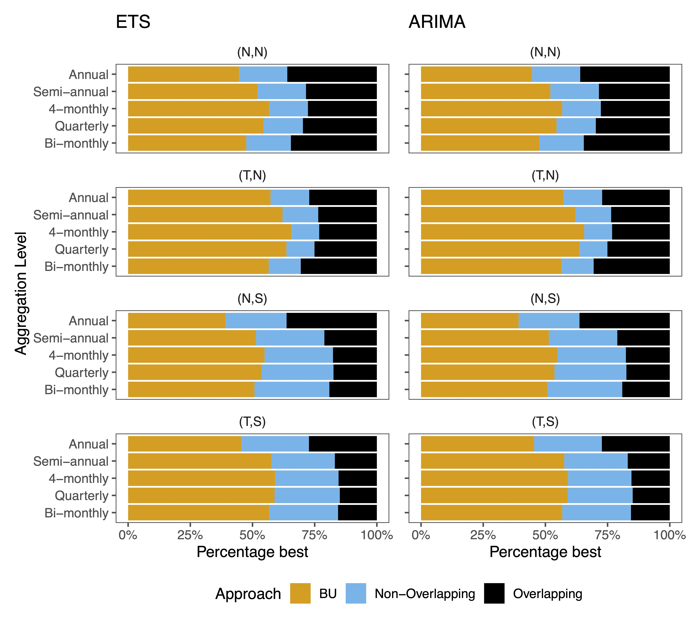
```

---
## Performance of AF vs. AD (based on non-overlapping temporal aggregation)


```{r ad-afboxplot, echo=FALSE, out.width="60%"}
knitr::include_graphics("figure/box_plot_rmsse.png")
```

---
## Questions

Given the comparative performance of temporal aggregation approaches :

* Whether combining forecasts generated by Bottom-Up (BU), Non-overlapping (NOA) and Overlapping approaches (OA) improves the forecast accuracy? how to combine?

* How data temporal aggregation changes time series features and is there any association between time series features and the forecasting performance of AD versus AF?


---
background-image: url("resources/hierarchy-left.jpeg")
background-size: contain
background-position: left
class: middle

.pull-right2[
## Outline

- Temporal aggregation: why do we need it in time series forecasting and what are the common approaches?

- How does temporal aggregation approaches perfrom on M4 competition data?

- .remember[Whether combining forecasts generated by temporal aggregation improves the forecast accuracy? how to combine (**Working paper 1**)?]

- How data temporal aggregation changes time series features and how might time series features affect the forecasting performance of AD versus AF (**Working paper 2**)?
]

---
## Experiment design - 1

```{r experiment, echo=FALSE, out.width="45%"}
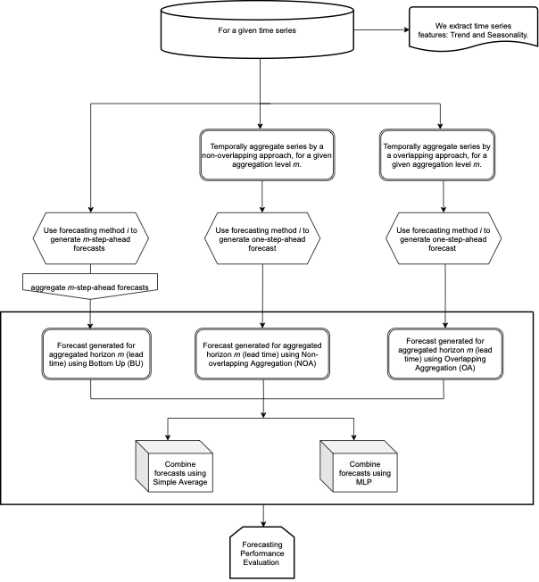
```


---
## Combining algorithm

```{r MLP, echo=FALSE, out.width="70%"}
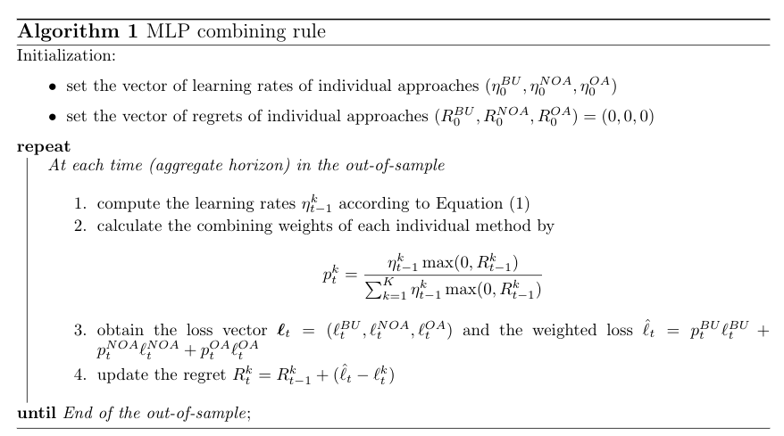
```

.footnote[Cesa-Bianchi, Nicolo, and Gábor Lugosi. "Potential-based algorithms in on-line prediction and game theory." Machine Learning 51.3 (2003): 239-261.]

---
### Mean (median) MASE for M4 monthly series with ETS forecasting method

```{r MLPresult, echo=FALSE, out.width="60%"}
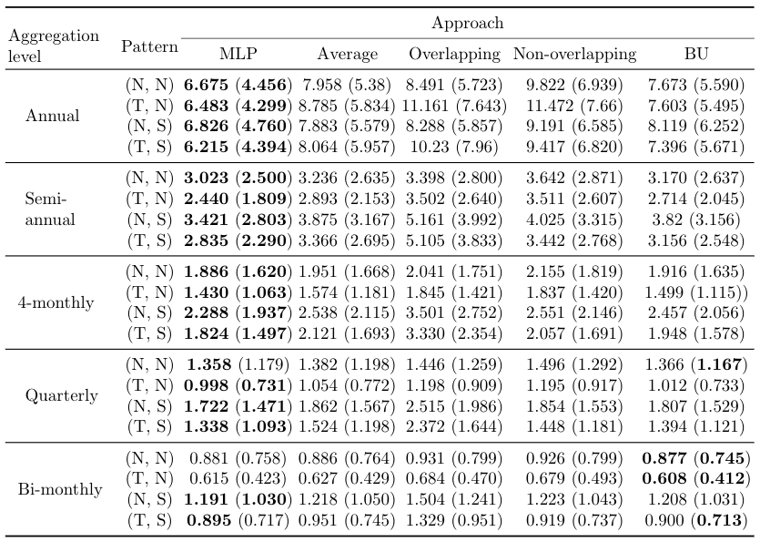
```

---
background-image: url("resources/hierarchy-left.jpeg")
background-size: contain
background-position: left
class: middle

.pull-right2[
## Outline

- Temporal aggregation: why do we need it in time series forecasting and what are the common approaches?

- How does temporal aggregation approaches perfrom on M4 competition data?

- Whether combining forecasts generated by temporal aggregation improves the forecast accuracy? how to combine (**Working paper 1**)?

- .remember[How data temporal aggregation changes time series features and how might time series features affect the forecasting performance of AD versus AF (**Working paper 2**)?]

]

---
## Experiment design - 2

```{r experiment2, echo=FALSE, out.width="45%"}
knitr::include_graphics("figure/experiment_design.png")
```

---
## How does non-overlapping TA change time series features?

```{r ta-feature2, echo=FALSE, out.width="50%"}
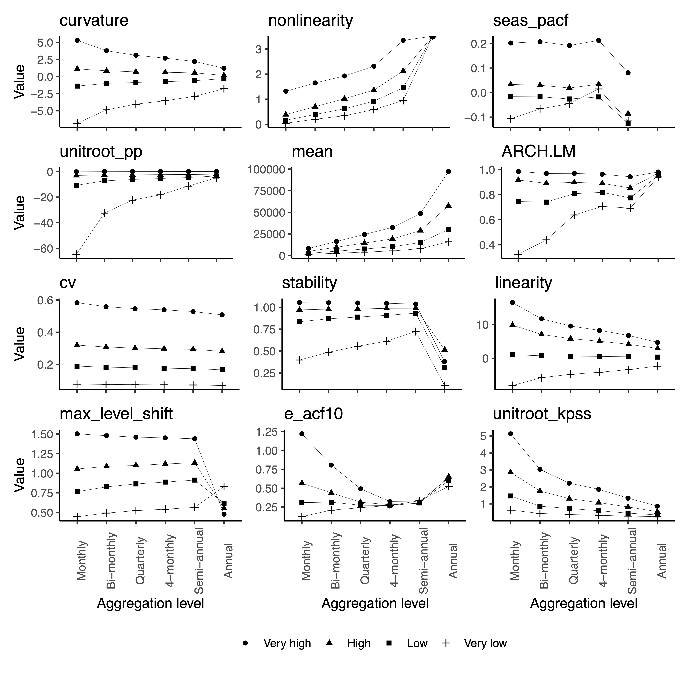
```

---
## How does non-overlapping TA change time series features (continue)?

```{r ta-feature, echo=FALSE, out.width="50%"}
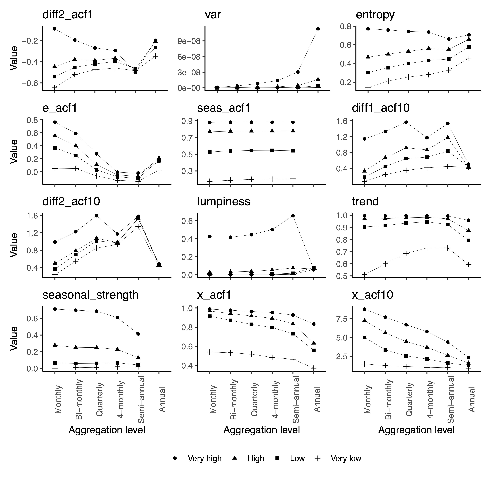
```


---
## Features relationship and AD/AF performance

```{r pairplot, echo=FALSE, out.width="60%"}
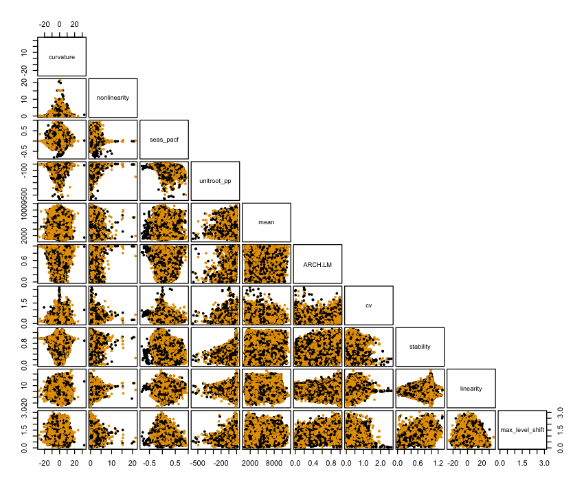
```

---
# MCB test for all classiefiers

```{r ml-predict, echo=FALSE, out.width="70%"}
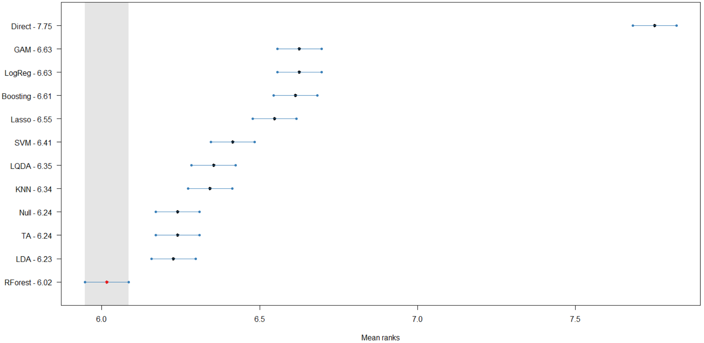
```

We also use missclassification error, F-statistics and Area under the Curve(AUC).

---
## Important features

```{r feature-importance, echo=FALSE, out.width="80%"}
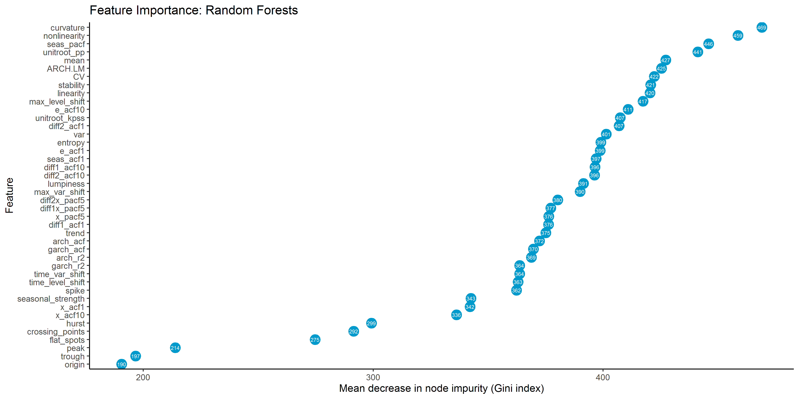
```

???
feature importance or variable importance, help us understand which features are most important in driving the predictions of these two models overall, aggregated over the whole training set.
One way to compute variable importance is to permute the features (Breiman 2001a). We can permute or shuffle the values of a feature, predict from the model, and then measure how much worse the model fits the data compared to before shuffling.

---
## Partial dependence plot
### Probability of AF performing better
```{r partial-dependence-plot, echo=FALSE, out.width="45%"}
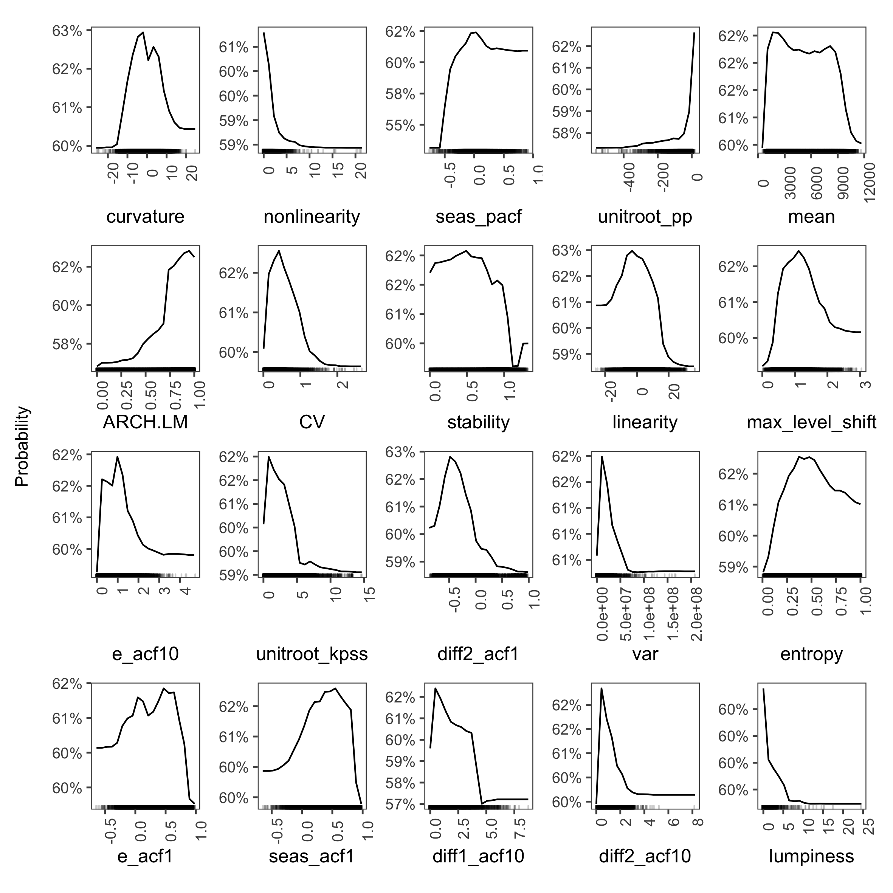
```

---
## Partial dependence plot (continue)
### Probability of AF performing better

```{r partial-dependence-plot1, echo=FALSE, out.width="40%"}
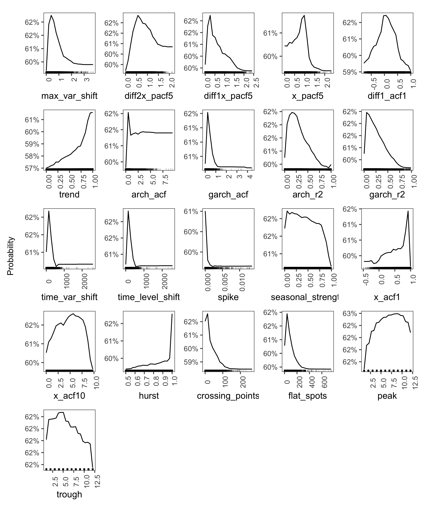
```

---
## Summary and conclusions (continue)

- Although aggregating time series seems to be intutive, it might not always improve forecast accuracy. Our results indicate that Aggregate Forecast is a competitive approach, but neither of them dominate. They both have a merit.

- Combining aggregate data (non-overlapping and overlapping) and aggregate forecast approaches improve forecast accuracy. Combination again works here.

- Aggregate data using temporal aggregation changes the features of time series. The magnitude of the change varies for different features. In particular, we observe that with increase in the aggregation level, the strength of seasonality, the autocorrelation, coefficient of variation, linearity, curvature  and KPSS unitroot statistic decrease. However, non-linearity, mean, variance, ARCH.LM, trend , unitroot pp statistics increase. Entropy is the only measure that both increases and decreases based on its initial value.

---
## Summary and conclusions

- Random Forest model is the most accurate classifier among ML algorithm in predicting which approach provides more accurate forecast given a set of time series features as input.

- The most important features for predicting whether AF or AD should be used for a given monthly time series in M4 competition include *curvature*, *nonlinearity*, *seas_pacf*, *unitroot_up*, *mean*, *ARCHM.LM*, *Coifficient of Variation*, *stability*, *linearity* and *max_level_shift*.

- Increasing trend, ARCH.LM, hurst, autocorrelation lag 1 and unitroot_pp and seas_pacf may increases the chance of AF performing better.

- Increasing lumpiness, entropy, no-linearity, curvature, stremgth of seasonality may increase the chance of AD performing better, so the strong presence of these features may favorite AD over AF.

---

.pull-left[
### Wrok in progress
- Rostami-Tabar B., Goltsos T. Wang, S. (2022), Forecasting for lead-time period by temporal aggregation: Whether to combine and how

- Rostami-Tabar B., Mercetic D. (2022), On time series features and the perfromance of emporal aggregation
]

.pull-righ[
### Published recently
- Mircetic, D., et al. (2021), "[Forecasting hierarchical time series in supply chains: an empirical investigation](https://www.tandfonline.com/doi/full/10.1080/00207543.2021.1896817)." International Journal of Production Research, 1-20.
- Babai. M.Z., Boylan, J., Rostami-Tabar, B. (2021), "[Demand Forecasting in Supply Chains: A Review of Aggregation and Hierarchical Approaches](https://www.tandfonline.com/doi/full/10.1080/00207543.2021.2005268)", International Journal of Production Research, 1-25.
]


---
## References for temporal aggregation forecasting

- [An aggregate–disaggregate intermittent demand approach (ADIDA) to forecasting: an empirical proposition and analysis](https://www.tandfonline.com/doi/full/10.1057/jors.2010.32?casa_token=FLX_iKeIDXcAAAAA%3ACXYWY6jICM_1_ayaadc8GXxN05kAFo5I_qqmt7XvBjEMTHBUTWLA8kziBWQhUVj-BdNWTwJnIw). Journal of the Operational Research Society.
- [Improving forecasting via multiple temporal aggregation](https://www.sciencedirect.com/science/article/pii/S0169207013001477?casa_token=PhrGiXHJJzsAAAAA:-PU7metoOVL4G7avKR6NT9m5kzGNHPy5Lo14iEhVHqtju_L_hRUatM0M3CV3UilcBA47EuU). International Journal of Forecasting.
- [Demand forecasting by temporal aggregation](https://onlinelibrary.wiley.com/doi/full/10.1002/nav.21546?casa_token=wfP5AIk8wAQAAAAA%3A4skkyZgQCyVdftE194ZG_16CgG7CfL6-6_kb2Sqi0aiJ0aC4cWL4x2bmmRMPdupj4P4_9lihPLj3), Naval Research Logistics
- [Forecasting with temporal hierarchies](https://www.sciencedirect.com/science/article/pii/S0377221717301911?casa_token=wVe_QYpCEFoAAAAA:LT-rFP_KTK8Wbr1iQnqpGpNXjKiocfoSBuM4-0SfYTEB_6njOQcELohyPLiuPQuSgEkstCc), European Journal of Operational Research


---
class: inverse, middle

- Slides and papers: [www.bahmanrt.com](www.bahmanrt.com)
- Check out also [www.f4sg.org](www.f4sg.org)

<br><br>
`r fa("twitter", fill = "white")` Say hello: [@Bahman_R_T](https://twitter.com/Bahman_R_T)

`r fa("linkedin-in", fill = "white")` Connect: [Bahman ROSTAMI-TABAR](https://www.linkedin.com/in/bahman-rostami-tabar-1046171a/)
